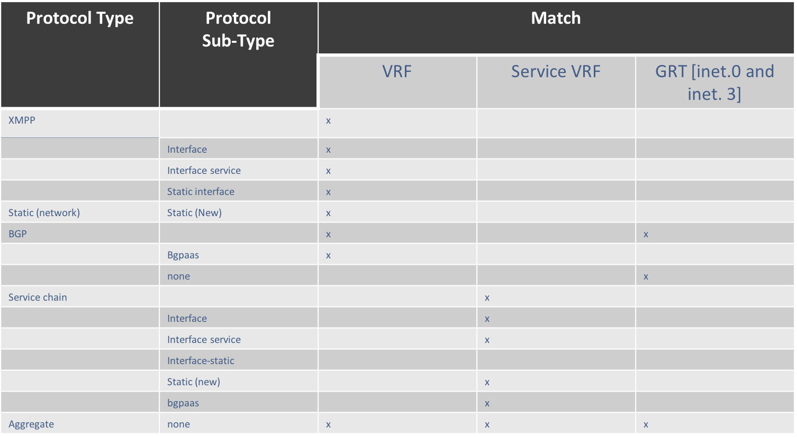

# 1. Introduction
Contrail allows Routing Policies (import only) to be applied to Service
Instances, futhermore the policies apply only to non-replicated routes in
the service routing instance.
The only granularity currently available for non-replicated routes is either,
Service Chain (re-originated) or Aggregate.
The enhancements introduced address the lack of sufficient granularity,
flexibility and Export Policies.

# 2. Problem statement
The explosion of leaked routes in the routing table of the SDN Gateway
drives the requirement to enhance routing policies to provide further
granularity to prevent service interface and static routes from proliferating.

# 2.1 Use cases
## 2.1.1 Use-case 1
   * Distinguish service interface routes from other VM routes to
     prevent routes from being leaked and exploding route tables of
     SDN Gateway.

## 2.1.2 Use-case 2
   * Setting LocalPref on service interface static routes when exporting
     to distinguish routes and take further action.
   * Setting different LocalPref for all other reoriginated routes to
     distinguish routes and take further action.
   * Setting different ASPATHs to control routing decisions.

## 2.1.3 Use-case3
   * Contrail sets Local Pref based on Community on imported routes, instead
     of DC GW, and allowing direct access to VPN Internet-Shared from Contrail


# 3. Proposed solution

Routing policies will be further enhanced to:
 * Allow Import Routing Policies to be applied to networks.
 * Add more granularity to routes by introducing a Sub-Protocol.
   The Sub-Protocols will appear as additional options in the match
   term condition along-side Protocols.
   (In addition to xmpp, bgp, static, aggregate and servicechain we will now
   have interface, service-interface, interface-static and bgpaas)
   Following is a list of Sub-Protocol additions:
    a) XMPP: interface, interface-static, service-interface.
    b) BGP: bgpaas.
    c) Static: static (to allow filtering in the SI when the Protocol is
       Service Chain).
    d) ServiceChain :  Will inherit all Sub-Protcols above (re-originated routes)
     
 * Add policy action to expand AsPath using the given ASN list.

## 3.1 Alternatives considered
None, this is a feature enchancement providing more flexibility and granularity.

## 3.2 API schema changes

```
--- a/src/schema/routing_policy.xsd
+++ b/src/schema/routing_policy.xsd
@@ -22,6 +22,15 @@
     </xsd:restriction>
 </xsd:simpleType>

+<xsd:complexType name='AsListType'>
+    <xsd:element name='asn-list' type='xsd:integer' maxOccurs='unbounded'/>
+</xsd:complexType>
+
+<xsd:complexType name="ActionAsPathType">
+    <xsd:element name='expand'   type='AsListType'/>
+</xsd:complexType>
+
 <xsd:complexType name='CommunityListType'>
     <xsd:element name='community' type='CommunityAttribute' maxOccurs='unbounded'/>
 </xsd:complexType>
@@ -33,6 +42,7 @@
 </xsd:complexType>

 <xsd:complexType name="ActionUpdateType">
+    <xsd:element name="as-path"     type="ActionAsPathType"/>
     <xsd:element name="community"   type="ActionCommunityType"/>
     <xsd:element name="local-pref"  type="xsd:integer"/>
     <xsd:element name="med"         type="xsd:integer"/>
@@ -55,9 +65,11 @@
     <xsd:restriction base="xsd:string">
         <xsd:enumeration value="bgp"/>
         <xsd:enumeration value="xmpp"/>
         <xsd:enumeration value="static"/>
         <xsd:enumeration value="service-chain"/>
         <xsd:enumeration value="aggregate"/>
+        <xsd:enumeration value="interface"/>
+        <xsd:enumeration value="interface-static"/>
+        <xsd:enumeration value="service-interface"/>
+        <xsd:enumeration value="bgpaas"/>
     </xsd:restriction>
 </xsd:simpleType>

```

## 3.3 User workflow impact

Users will be able to configure new Term Match and
and Action attributes as stated earlier.

## 3.4 UI changes

 * UI to add ability to associate a routing policy with a Network.
 * UI to add additional protocol Term Match under
   Configure > Networking > Routing > Routing Policies
   while adding a new Route Policy for interface-route,
   interface-static and service interface outes.
 * UI to add ability to update the ASPATH list attribute as an action.

## 3.5 Notification impact
None.

# 4. Implementation

### 4.1.1 Control-Node
Control-Node will need to add the sub-protocol attributes for static (network)
and Bgpaas routes. Introspect will need to be enhanced to display the
sub-protocol for routes, if present, incuding sub-protocol added by the Agent
for routes received over XMPP.
The Control-Node will need to process the new match conditions, and ASPATH list
modifications.

### 4.1.2 Compute Node

All routes advertised from Compute Node are bundled under protocol XMPP. XMPP
routes need to be distinguish further into interface, service-interface and
interface-static before advertising them to the control-node.

# 5. Performance and scaling impact
None.

## 5.2 Forwarding performance
There should be no forwarding performance impact.

# 6. Upgrade
None.

# 7. Deprecations
None.

# 8. Dependencies
None.

# 9. Testing
## 9.1 Unit tests
## 9.2 Dev tests
## 9.3 System tests

# 10. Documentation Impact

# 11. References
[Enhanced routing policies blue-print](https://blueprints.launchpad.net/opencontrail/+spec/enhanced-routing-policies)
