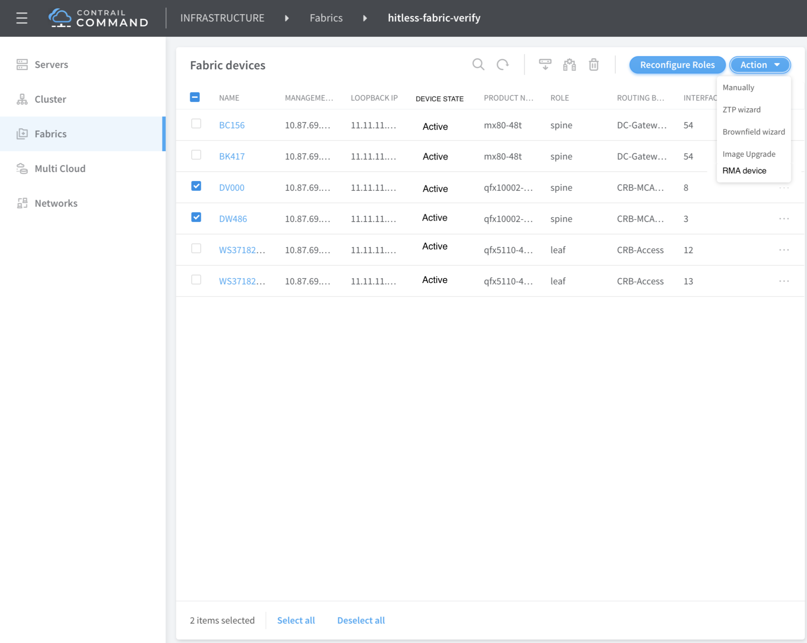
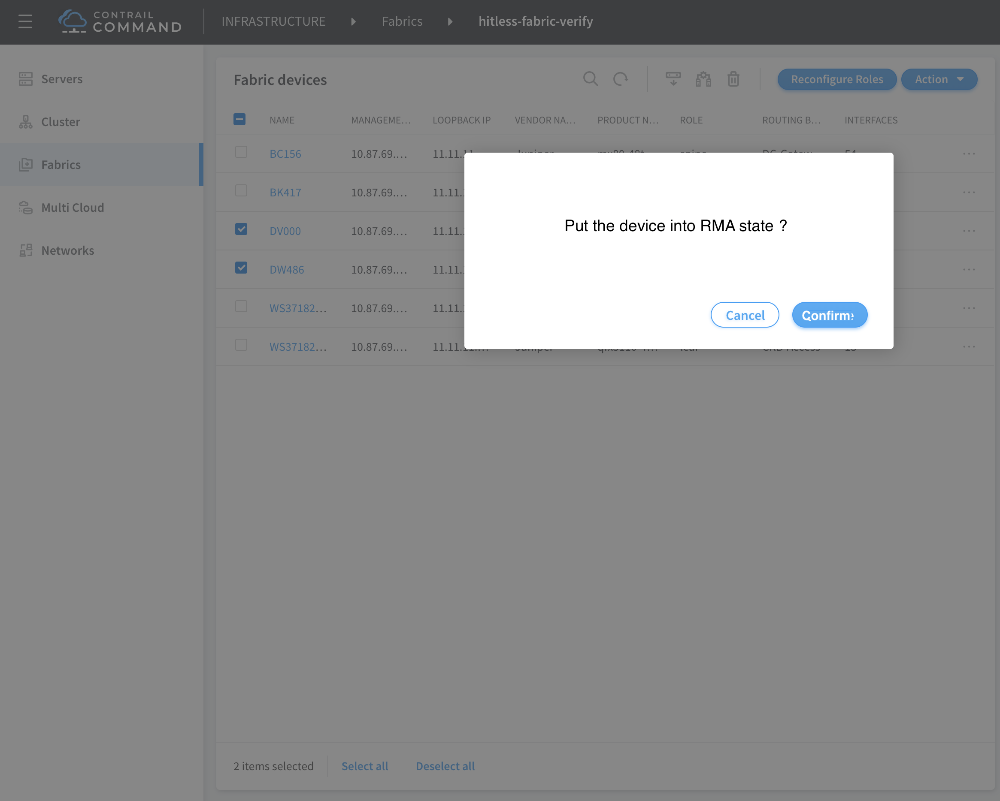
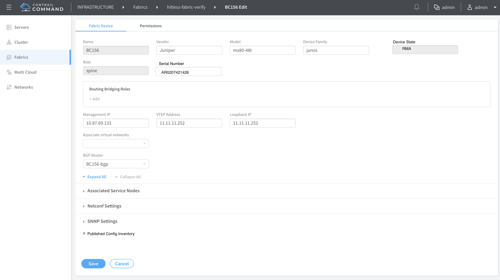
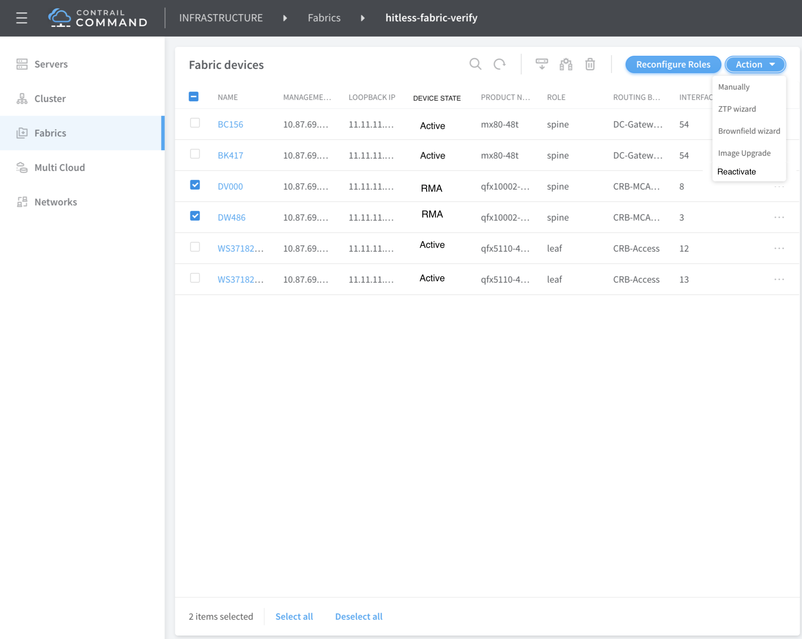
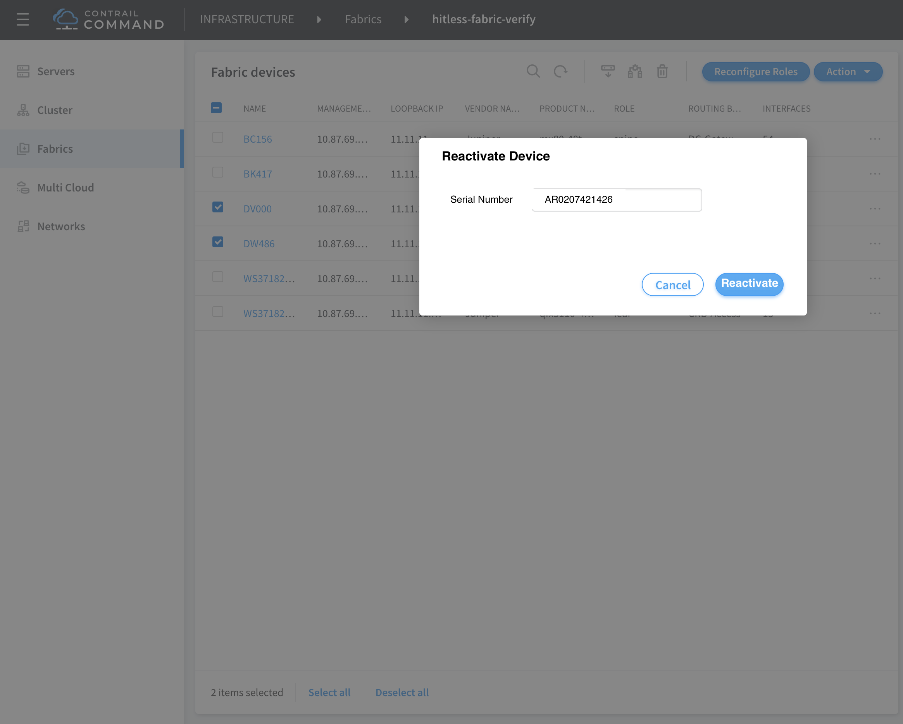

# 1. Introduction
RMA stands for Return Material Authorization. If a hardware failure is
determined by the JTAC engineer and repair/replacement is needed, an RMA will
be created. This RMA provides the customer with the ability to return the
specified defective unit for replacement in line with the purchased
SLA (Service Level Agreement).

# 2. Problem statement
As of today there is no support for RMA via Contrail Command. There is a need 
for putting the RMA workflow in place to support the repair/replacement of 
Juniper devices. The user should be able to just enter the serial number of the
new device and be able to replace it in place of the old device seamlessly.

#### Usecase 1: 
Customer should be able to RMA a device that has been on-boarded 
using the brownfield workflow. In this scenario the underlay configuration
is not managed by Contrail.

#### Usecase 2:
Customer should be able to RMA a device that has been on-boarded
using the greenfield workflow. In this scenario both the underlay and the 
overlay configuration is managed by Contrail.

# 3. Proposed solution
The RMA support in Contrail will include the following changes/additions:

1) To provide support for RMA, the device underlay configuration is backed up 
before any configuration is pushed onto it from Contrail during device
on-boarding step. This is required only in the brownfield workflow. 
2) The user will be able to put the device into 'RMA' state by selecting the 
'RMA device' action in the Fabric Devices page.
3) Once the replacement device is in place and wired into the network, 
the user can select the action 'Reactivate'. The user will then be prompted 
to enter in the serial number of the new device. Once this is done Contrail 
will internally push the backed up configurations (in case of brownfield
usecase) and also automatically apply the same roles as the earlier device.

# 4. User workflow impact
The following screenshots capture the use visible changes

# 5. References
