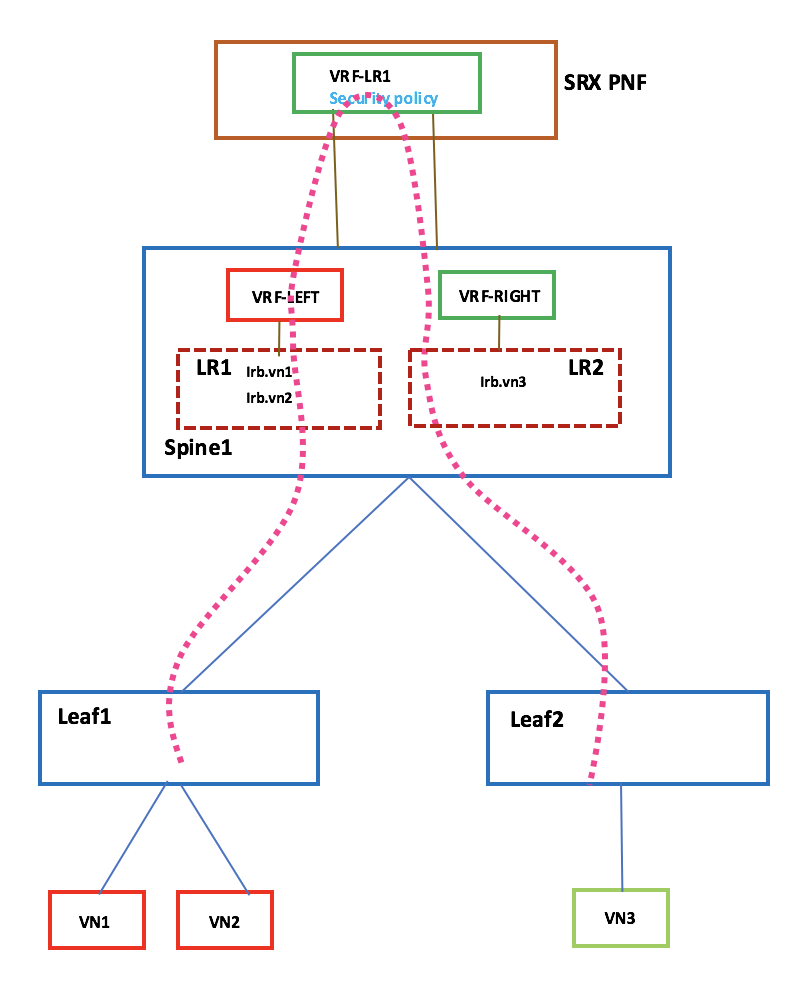
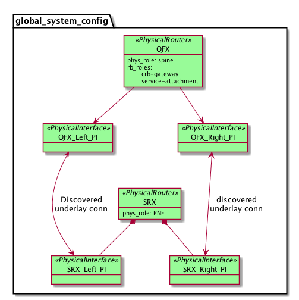
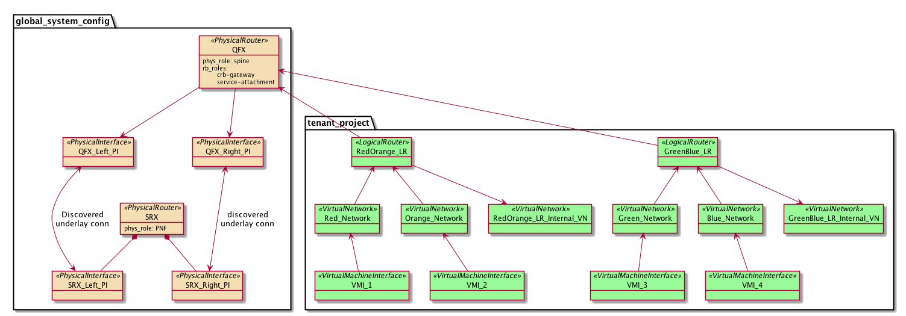
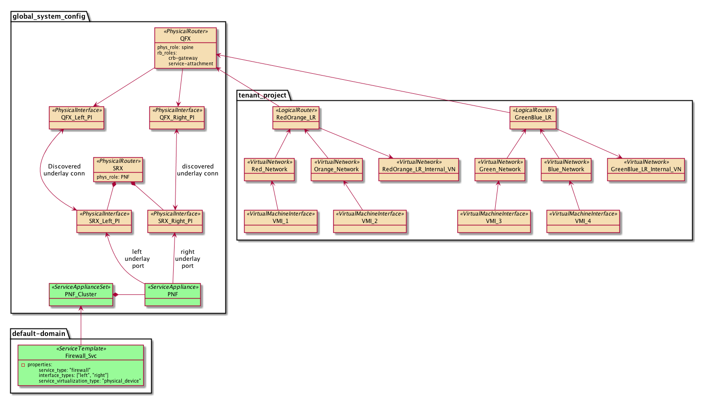
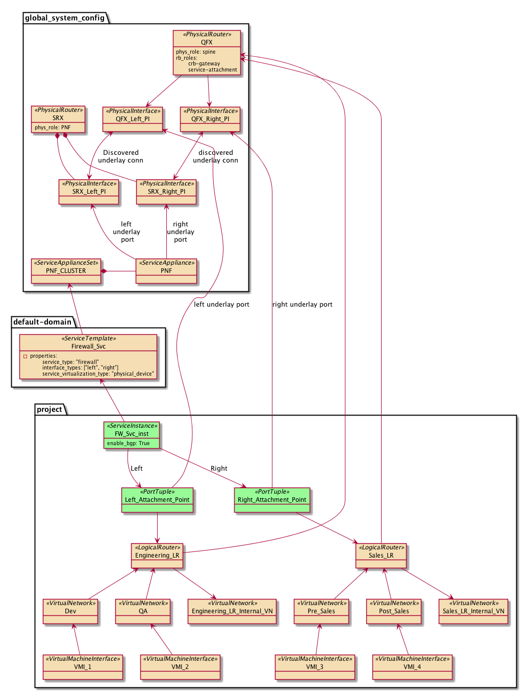

# 1. Introduction
This spec covers the design and implementation of providing the L3 PNF support for creating service chains for inter L3 VRFs traffic only. 

# 2. Problem statement

To allow inter LR (Logical Router) traffic to go through service chain, we need to insert a PNF device with service functions. This PNF device will be attached to L3 VNI capable device (TOR or Spine).

#### Use cases
The main use case is to allow inter LR traffic to go through service chaining works for traffic between BMS

# 3. Proposed solution
In order to address the above problem we propose the following solution:
- PNF = 1 attached to L3 VNI capable device (TOR or Spine)
- Service VRFs: Dedicated Left and Right service VRFs will be created by Contrail on QFX device. These are distinct VRFs from the tenant VRFs. PNF device will also have a seperate Left and RIght VRF
- When the user creates the service instance, user must have a knob to select whether to use BGP between QFX (where PNF is atatched) and PNF routing instance itself or to configure static routes to divert the traffic from QFX to SRX
- When the user creates the service instance, user must have a knob to select whether service VRFs are SHARED (Left and Right service VRFs are same as Logical router VRF) or not SHARED (Left and Right VRF instances on QFX are distinct from the Logical Router VRF)
- Devices operating as service functions in service chaining must be associated to
      - A physical role: [PNF]
      - An overlay role: [L3 FW]
- QFX must be associated to an overlay role [Service-attachement) if it is connected to PNF device
- PNF will be discovered and on-boarded in the contrail fabric.

## 3.1 Alternatives considered
#### NA

## 3.2 API schema changes
As of now, changes are required in Service Appliance Set and Service Instance object.
- Service Appliance set object should have an attribute to indicate whether this is for PNF device or VNF device
- Service Appliance object should have an attribute to indicate whether Firewall configuration on the PNF device needs to be done by contrail or manually
- Service Instance object should have an attribute to select whether to use BGP between QFX or static routing
- Service Instance object should have an attribute to select whether service VRFs are shared or not shared
- Service Instance object should specify the Logical Routers that are to be attached to the Left and Right side of the PNF in the port tuple along with the Left and Right side of the VNI capable device
- New physical role (PNF) and overlay role (L3FW) will be defined for PNF devices

## 3.3 User workflow impact
- User enters the management subnet for discovery of PNF device
- Using the management subnet, PNF device is discovered and on-boarded in the contrail fabric. It is assumed that underlay connectivity is already set-up between PNF device and Spine
- PNF device is associated with physical role (PNF) and an overlay role (L3FW)

- User also enters the namespace for service chain subnets which will be used by IPAM to allocate IP addresses for interfaces participating in service chain

- User creates the service appliance set under Configure > Infrastructure > Service Appliance Sets. It is created with an attribute to indicate that this is for PNF device
- User creates service template under Configure > Services > Service Templates. Virtualization Type is set to Physical Device and this template is associated to the service appliance set previously created.

- User also selects the interfaces to be used (Left, Right or Management)
- User creates the Service appliance under Configure > Infrastructure > Service Appliances. User should add the left and right interfaces of the PNF device (from the drop-down list of interfaces already onboarded in the fabric)
- User creates PNF service instance under Configure > Services > Service Instances. User needs to select the service template to use and also select the corresponding left and right network in the port tuple
- Left port tuple consists of left logical router and left side interface on the spine which connects to the PNF device.
- Right port tuple consists of right logical router and right side interface on the spine which connects to the PNF device

## 3.4 UI changes
- Support for discovery/onboarding of PNF device. New physical and overlay roles discussed above needs to be supported
- Support for new namespaces in fabric onboarding
- Support for adding new attribute in Service Appliance set to indicate either PNF or VNF device
- Support for adding service appliance under service appliance set
- When creating service appliance, user should be able to select whether firewall is configured manually or by Contrail
- User can create/edit/modify a Service Template to create a new PNF Service Template
- User creates the Service Instance referring to previously created Service Template
- While instantiating the service, user should be able to select the below:
    - Whether to use BGP between QFX and SRX routing instance or static routing
    - Whether to use shared VRF or non shared VRF
- User then selects the Logical Routers that are to be attached to the Left and Right side of the PNF in the Service Instance

## 3.5 Notification impact
#### Describe any log, UVE, alarm changes

# 4. Implementation
##4.1 PNF discovery and on-boarding in contrail fabric
- Only brownfield deployment is supported for the PNF device
- PNF is attached to 2 L3 VNI capable devices (TOR or Spine)
- Using management subnet, PNF needs to be discovered in the fabric
- Once PNF is discovered, PNF physical role is assigned to the device.
- After discovery, all the underlay interfaces on the PNF device (could be a physical port or an Aggregate ethernet port) are on-boarded

##4.2 Service Template creation for the PNF device
- Under Network Policy-> Service Template tab, user needs to create a Service Template to create a new PNF service template
- User then select attributes such as Physical role (PNF in this case) and the overlay role (L3FW)
- User also selects whether service instance created from this template will be SHARED (one and only one Left and Right VRF instance will be created for all inter VN network policies) or not SHARED (for each inter VN network policy one Left and one Right VRF instance will be created

##4.3 Service Instance Creation from Template
- Under Network Policy-> Service Instance tab, user needs to create a Service Instance referring to a previously created service template
- User then selects the logical routers that are to be attached to the Left and Right side of the PNF device along with Left and Right side of QFX device.
- Left and Right service VRF must be configured in each device to which PNF is attached
- Left and Right VRF must be configured on the PNF device for each service instance

While creating fabric, user needs to specify the IP address pool for service chain subnets, which will be used by IPAM to allocate IP addresses for the device interface and the PNF interface. This pool should not overlap with the virtual network IP address pool.

At this point, contrail configures the below on the TOR or Spine device:
- If service instance is enabled for non shared VRF attribute, creates the Left and Right service VRFs and route leaking from tenant VRF to Left and Right VRF
- If service instance is enabled for shared VRF attribute, contrail will use the Logical router VRFs instead of creating new service VRFs
- Configures the VLAN and the IP addresses on the device interface and the PNF interface
- Configures these ifls into the Left and Right VRF
- Created Left and Right VRF on SRX
- If service instance is enabled for BGP attribute, configures BGP session between service VRF instances and SRX routing instances
- If service instance is enabled for static routing, configures static routes for LRs pointing to the PNF ifl as next-hop

##4.4 Tasks breakdown
- Support for discovery and on-boarding of PNF device (SRX model) in contrail fabric – This involves changes in Ansible playbooks for device discovery and device on boarding. Node profile and roles needs to be enhanced to support new physical role (PNF) and overlay roles
- New overlay role (L3 service chain) needs to be defined for Spine device. Overlay role (L3 FW) needs to be defined for PNF device
- Support for adding a new physical plug-in in device manager for PNF physical role.
- API server changes to incorporate data model changes. This may involve some changes in schema transformer as well
- DM changes to listen for new objects notification and building the local cache
- DM changes to update the dependency tracker
- DM changes for resource allocation for IP address management on service IFLs, Vlan management for service IFLs and route target management
- DM changes for business logic for QFX to generate the abstract config
- DM changes for business logic for SRX to generate the abstract config
- QFX jinja template for generating QFX configuration to support service chaining
- SRX jinja template for generating SRX configuration along with L3 FW config

# 5. Performance and scaling impact
## 5.1 API and control plane
#### Scaling and performance for API and control plane

## 5.2 Forwarding performance
#### Scaling and performance for API and forwarding

# 6. Upgrade
#### Describe upgrade impact of the feature
#### Schema migration/transition

# 7. Deprecations
#### If this feature deprecates any older feature or API then list it here.

# 8. Dependencies
#### Describe dependent features or components.

# 9. Testing
## 9.1 Unit tests
## 9.2 Dev tests
## 9.3 System tests

# 10. Documentation Impact

# 11. References
- https://docs.google.com/document/d/1ZAOtxjdPGerFoZp_4uI0t_6jWD8P-iTGE4JOHfv8AVc/

# 12. Not supported features for current release.
- VNFs are not supported for creating service chains in 5.1
- L3 PNF is only supported for inter VN traffic to go through service chain workflow for traffic between BMS's only
- Only one overlay role - L3FW is supported in 5.1
- Only below physical SRX devices are supported in 5.1
       - SRX 5400, 5600, 5800
- PNF high availability is not supported in 5.1
- ZTP is not supported for PNF devices in 5.1. Only brownfield deployment is supported for PNF device.
 
