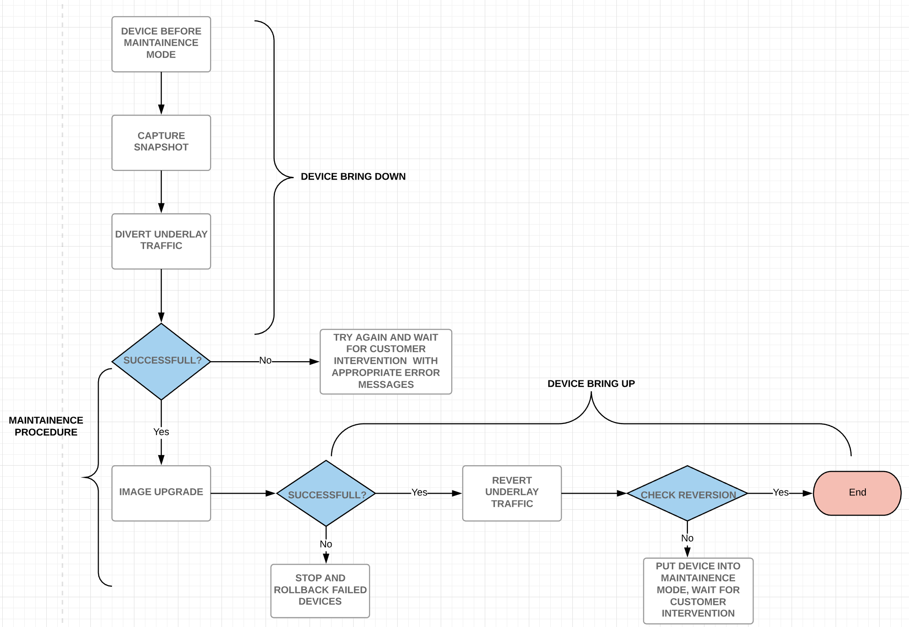
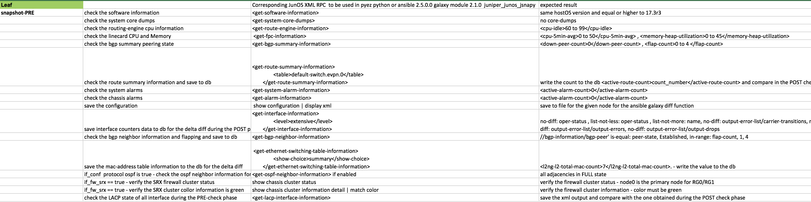

# 1. Introduction
Contrail Fabric Manager supports the automation of basic device management functions that includes image upgrade on the devices in the fabric. A further requirement is to support a seamless procedure for software upgrade on the leafs and spines of the fabric. This spec covers the design and implementation of providing the above requirement on a data centre fabric managed by Contrail. 

# 2. Problem statement
Image/Software upgrade on the device is a time consuming task. Whenever a device is re-imaged it goes through a series of steps that also includes a  reboot. Depending on the size of the image, it roughly takes about 20 mins for the device to come up to start functioning again. During this procedure, if live traffic is still going through the device a number of packets are lost. This has an adverse effect on the performance of the fabric especially when multiple devices are being upgraded simultaneously. Hence there is a requirement to divert the traffic flowing through this device to ensure zero packet loss. 

#### Use cases
The main use case is when the user wants to perform a controller assisted maintenance procedure (Software upgrade here) on a DC Fabric managed by Contrail with zero packet loss. 

# 3. Proposed solution
In order to address the above problem we propose the following solution to Seamless Software Upgrade on DC Fabric. 
We introduce a new state called the maintenance mode which the device can be put into before performing a software upgrade(or any other procedure) and can be restored back to the original state after the upgrade procedure has completed. 

There are three important activities related to putting a network device into maintenance mode:
- __Capture snapshot/Bring down the device__  - This includes capturing the running system state of the device for post upgrade verification assuming the pre-maintenance state is a good state, draining out the traffic flowing through it and redirecting in onto other equally capable device and finally verifying that there is zero traffic flow through the current device. 
- __Performing the maintenance activity__ - This maybe be a time consuming task that the device will perform after being put into maintenance mode. We focus on image upgrade in this context. 
- __Bring up the device/Verification__ - This includes restoring the device into service, verifying that is it carrying the expected level of live traffic and is in the original operational state. This generally leverages a pre-maintenance snapshot.

The main objective is that both during bring up and bring down:
- No live user traffic is lost.
- The activity can be performed without a maintenance window.
- No other device in the fabric is disturbed other than the one being maintained.
- No assumptions are made about the configurations of an external device.

## 3.1 Alternatives considered
#### NA

## 3.2 API schema changes
#### Describe api schema changes and impact to the REST APIs.
Nothing planned for now.

## 3.3 User workflow impact
Let the controller assisted maintenance procedure be an image upgrade as per context. When the user selects a group of devices to perform the image upgrade on, he should be able to perform the THREE important activities mentioned above, which is bring down the device, perform the image upgrade and then bring up the device. 

## 3.4 UI changes
There are several scenarios under which a device needs to be put into maintenance mode other than a software upgrade such as fixing/replacing a physical component of the device, adding/removing physical connections etc. These situations demand that "maintenance mode" be a whole separate option that the user can select before performing an activity. 
One option being planned for the initial release is as below:
1. __Controller Driven__ : Putting the device into maintenance mode when the user selects a procedure that we know for sure will require the traffic flowing through the device to be suspended to make sure the performance of the entire fabric is not hindered. Software upgrade is the right example. When the user selects a list of devices and clicks on "Upgrade Software" the entire workflow of bringing the device down, performing the upgrade and bringing it up is automatically initiated. 

## 3.5 Notification impact
#### Describe any log, UVE, alarm changes
Whenever the device goes through the maintenance mode procedure, the status of the device must be logged periodically to keep the user updated.
- __Job Logs__ : These logs will describe the current phase the device is in or the activity being performed on the device. For example:
    * "Putting device into maintenance mode"
    * "Capturing snapshot of the device"
    * "Bringing device up from maintenance mode"
- __Job_UVE Logs__ :  Job percentage completion information.
- __Device_UVE Logs__: Device status. In/out of maintenance mode.

# 4. Implementation
- The implementation procedure is focused on CONTROLLER DRIVEN workflow mode for image upgrade. It consists of five important phases.
- The customer is required to provide inputs such as the kind of maintenance activity ( image upgrade here), maximum number of devices to go through the maintenance activity using the user interface. 
- From the UI perspective, the image upgrade will have two sub buttons, one with maintenance mode, one without. If the one with maintenance mode is selected a new maintenance mode playbook is first called that will in turn call the image upgrade playbook upon completion. 
- The controller will then perform the following two phases before putting the selected device into maintenance mode. 

## 4.1 Phase1 - ROLE DISCOVERY
- In the Cloud Fabric architecture there are multiple device roles. Each device role has a specific placement in the cloud fabric topology, and may use technologies specific to the role.  Hence some of the requirements for enabling seamless maintenance for each role may be unique to that role.
- Once the user has selected a device/devices to perform the maintenance procedure on, each of their fully qualified roles needs to discovered to push appropriate configurations.
- With an access to the VNC database, the fabric containing the subset of devices selected can be referenced. Information about each of their fully qualified roles are fetched from multiple reads to the VNC database.
- With this information the selected devices are ordered in a particular sequence according to which they are put into maintenance mode one after the other.
- The general sequence based on roles is : __CRB-Acess@Leaf --> CRB-Gateway@Leaf --> DC-Gateway@Leaf --> CRB-Gateway@Spine --> DC-Gateway@Spine__
Other roles will be considered in future releases.

## 4.2 Phase2 - VALIDATION CHECKS
After role discovery, a couple of important validation checks have to be made before bringing down the device. The checks are as follows:
- __Check if the device is multi-homed__ : This check is required to make sure that there is another equally capable device ( with the same ESI number ) to which the live traffic from the current device can be directed to, If that is not present, there will be traffic loss when the device goes down anyway hence maintenance mode procedure is not required and the user can continue the image upgrade without it being hitless. The user needs to be notified of such a scenario. 
- __Check for device image compatibility__ : The selected image needs to be compatible with the device/devices listed. If the compatibility check fails, the user needs to be notified of the same and the maintenance procedure is not required.

After the first two phases, and if all the validation checks go through, maintenance procedure kicks in.

## 4.3 Phase3 - DEVICE BRING DOWN
This phase deals with three tasks as listed below. Each of these tasks are implemented inside an ansible playbook.
- Capturing the snapshot of the device.
- Putting device into maintenance mode and diverting the underlay traffic from the device.
- Verify the diversion.

The implementation details for each of these steps could vary depending on whether the device is a spine or a leaf. 

### 4.3.1 Capturing the snapshot of the device 
- Capturing snapshot of a device basically means checking the health of the given device. Certain junos commands are to be executed on the device to gather and verify details such as no-bgp flaps, consistent evpn route count, no-core-dumps, no interface flaps, no pfe drops etc.
- The junos commands are executed on the device using junos ansible module and this information is stored in memory inside the context of the playbook which is used later on after device bring up for comparison to ensure that the device has been brought back to the correct operational state. 
- The displayed pictures below show the appropriate Junos commands that need to be executed on a leaf and spine to capture their snapshot.

### 4.3.2 Putting device into maintenance mode and diverting the underlay traffic from the device.
- This task involves two sub tasks.
    * Pushing the device into maintenance mode by sending down appropriate configurations. 
    * Diverting the traffic from the device into another capable device belonging to the same upgrade group (same ESI number)
- The config pushed varies depending on whether the device is a leaf or a spine. Jinja templates are used to render the configuration to be pushed. 
- Depending on the role of the device and place it takes in the defined sequence, configs are pushed down to the device in a certain order at a           
  certain time.
- Additional checks are made to verify if the device has any extra capabilities and according to the results, few more configurations are pushed down to achieve both the maintenance mode and traffic diversion successfully. 

### 4.3.3 Verify successful diversion.
- We need to verify if the suspension of traffic through the device and diversion of the traffic to another device has been successful. There are certain configuration metrics that are used for verification.

## 4.4 Phase4 - MAINTAINENCE PROCEDURE - IMAGE UPGRADE
 - After the traffic has been diverted, the image upgrade workflow (ansible playbook) is initiated on the device. 
 - A single job is spawned, but multiple devices are upgraded simultaneously depending on the sequence.
 - If the upgrade fails, the user is asked to try again. Upon consistent failures, customer intervention is requested.
 - After successful completion, the next phase to bring back the device to normal functionality is initiated.

### 4.4.1 Parallelism - Handling multiple devices simultaneously
   - Upgrading multiple devices simultaneously
   - Automatically determining small groups of devices
   - Restrictions on which devices can be upgraded at the same time

## 4.5 Phase 5 - DEVICE BRING UP
This phase deals with three tasks as listed below. Each of these tasks are implemented inside an ansible playbook.
- Bring up the device from maintenance mode.
- Revert the traffic back to the device.
- Capture snapshot to verify normal operational state. 

The implementation details for each of these steps could vary depending on whether the device is a spine or a leaf.

### 4.5.1 Bring up device from maintenance mode
- This tasks also involves pushing appropriate config down the device to bring it up from maintenance mode.

### 4.5.2 Revert traffic back to the device.
- This task involves two sub tasks:
    * Reverting the original traffic that was flowing through the device.
    * Bring device back up from maintenance mode.
- Here too, appropriate configurations are pushed down depending on the role and other capabilities the device might have.

### 4.5.3 Capture snapshot to verify normal operational state.
- This tasks involves running the same set of commands that was run before to capture snapshot of the device( leaf/spine). 
- The new device information is matched with the old information stored in the context to verify if all the device functionality has been brought back to normalcy. 

# 5. Performance and scaling impact
## 5.1 API and control plane
#### Scaling and performance for API and control plane

## 5.2 Forwarding performance
#### Scaling and performance for API and forwarding

# 6. Upgrade
#### Describe upgrade impact of the feature
#### Schema migration/transition

# 7. Deprecations
#### If this feature deprecates any older feature or API then list it here.

# 8. Dependencies
#### Describe dependent features or components.

# 9. Testing
## 9.1 Unit tests
## 9.2 Dev tests
## 9.3 System tests

# 10. Documentation Impact

# 11. References
- https://drive.google.com/open?id=1NLdcEnvSgTv0qEgtk1dpgn9qlhxDE7KbvfOmrg_dpbE 
- Annexes:
- https://drive.google.com/open?id=1tdGh3GZSKN0W5h1IUQ32H3ExB6HzDPSQ
- https://drive.google.com/open?id=1hsa8DqNxdUh3JcHbm_sab8_XoJ1UrHvR 

# 12. Not supported features for current release.
 - There are a number of different fully qualified roles that devices can take. We are not supporting all of those roles for the current release. We only support __CRB-Acess@Leaf, CRB-Gateway@Leaf, DC-Gateway@Leaf, CRB-Gateway@Spine, DC-Gateway@Spine__.
 - The UI has another use case of maintenance mode that it needs to incorporate that is:
    - __Customer Driven__ : The UI needs to provide an option to the user to put a device into maintenance mode whenever the user wants to perform a certain activity. The user must later be provoked to bring back the device to normalcy after the task is done. This means that there needs to be a button to "bring down" the device which should immediately switch to "bring up" after the traffic suspension has been initiated so that the user knows about the device's status.
 - For the controller driven approach the customer should be able to provide inputs such as the kind of maintenance activity ( image upgrade here), maintenance window size, maximum number of devices to go through the maintenance activity, maximum per end-endpoint service impact tolerance etc. using the user interface. Depending on all the inputs, the controller needs to be able to display to       the user the overall time it would take to complete the activity, provide suggested times for a maintenance window based on lowest activity levels on the network. 
 - The controller may also periodically suggest a maintenance activity and a recommended plan to the operator.  For example, when the controller identifies
	* a critical bug that needs to be resolved
	* a failing device or component
	* a running release is going end-of-service
	* a software license is expiring
