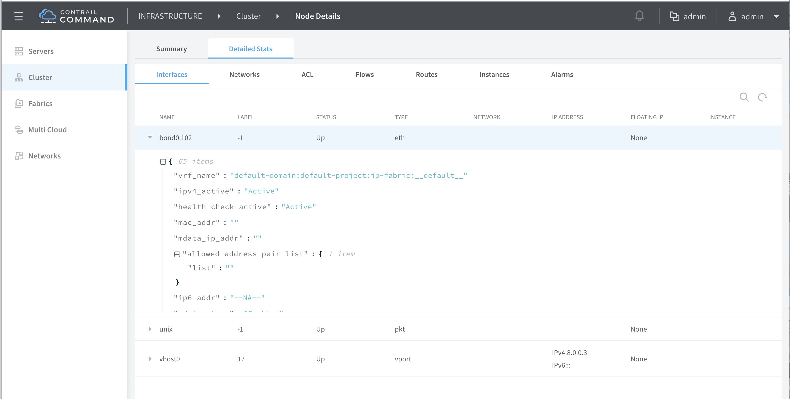

# 1. Introduction
Support for monitoring DPDK Bond members (Master/Slave) devices.

# 2. Problem statement
In current contrail implementation, there is no support to get the link status for fabric(Master)/Slave bond interfaces.

Currently Fabric(Master) bond interface is displayed in contrail GUI, but link status update is not working.

# 3. Proposed solution
Monitor individual bond members and send an alarm to Appformix to display the current link status of Master/Slave bond members in contrail GUI under Monitor -> Infrastructure -> Virtual Routers.

Currently, this will support only on DPDK systems.

##  3.1 'vif —list' command output

### a.  Display Fabric(master) & Slave Interface attached to bond Configuration.

Display Fabric(Master) and individual Slave interface name, link status & driver name to be displayed for interface type as physical.

```
vif0/0      PMD: 0 (Speed 1000, Duplex 1)
            Type:Physical HWaddr:9e:b1:2a:68:e8:58 IPaddr:0.0.0.0
						Vrf:0 Mcast Vrf:65535 Flags:XTcL3L2VpDpdk QOS:0 Ref:19
            RX queue errors to lcore 0 0 0 0 0 0 0 0 0 0 0 0 0 0 0 0 0 0
            Fabric Interface: eth_bond_bond0  Status: UP  Driver: net_bonding
            Slave Interface(1): 0000:04:00.0  Status: UP  Driver: net_ixgbe
            Slave Interface(2): 0000:04:00.1  Status: UP  Driver: net_ixgbe
            RX packets:0  bytes:0 errors:0
            TX packets:5  bytes:430 errors:0
            Drops:0
            TX port   packets:5 errors:0
            TX device packets:5  bytes:450 errors:0
```

### b. Display only Fabric Interface in case of Non-bond configuration

Incase of non-bond configuration, display fabric interface name, link status and driver name for Interface type as physical.

```
vif0/0      PMD: 0 (Speed 1000, Duplex 1)
            Type:Physical HWaddr:9e:b1:2a:68:e8:58 IPaddr:0.0.0.0
            Vrf:0 Mcast Vrf:65535 Flags:XTcL3L2VpDpdk QOS:0 Ref:19
            RX queue errors to lcore 0 0 0 0 0 0 0 0 0 0 0 0 0 0 0 0 0 0
            Fabric Interface: 0000:04:00.0  Status: DOWN  Driver: net_ixgbe
            RX packets:0  bytes:0 errors:0
            TX packets:5  bytes:430 errors:0
            Drops:0
            TX port   packets:5 errors:0
            TX device packets:5  bytes:450 errors:0
```


# 4. Implementation
## 4.1 DPDK

 Register for link status notification callback for individual bond interfaces. Whenever link goes UP/DOWN, vrouter DPDK will be notified through the callback. 

## 4.2 Interaction between Agent & DPDK
### 4.2.1 Netlink communication
When agent comes up, vrouter will notify interface names, link status and corresponding driver name to Agent via Netlink.

<u>For Bond setup:</u>

Incase of bond configuration, DPDK will give notification about the Fabric(Master) and slave interfaces.

<u>For Non-bond setup:</u>

Incase of non-bond, DPDK will give notification only about the fabric interface. 

Whenever DPDK receives link update, it should notify agent about the state change through netlink mechansim for individual bond interfaces.

The Notification contains bond interface name, bond driver name & its link status.

struct vr_dpdk_bond_member_info {
char intf_name[VR_INTERFACE_NAME_LEN];
char intf_drv_name[VR_INTERFACE_NAME_LEN];
}; 

Above structure used to transfer bond interface member(Master/Slave) information through Netlink message.

enum {
    VR_DPDK_FABRIC = 1,
    VR_DPDK_BOND_SLAVES,
};

Above enums to be used to differentiate Fabric(Master) and Slave notification type in Agent.

### 4.2.2 Sandesh message

Below sandesh parameters have been newly added under "vr_interface_req"  message to transfer bond interface information to vif utility CLI.

byte                 vifr_intf_status;
list<byte>      vifr_fab_name;
list<byte>      vifr_fab_drv_name;
byte                 vifr_num_bond_slave;
list<byte>      vifr_bond_slave_name;
list<byte>      vifr_bond_slave_drv_name;

# 5. Performance and scaling impact

##5.2 Forwarding performance
TBD

# 6. UI changes/ User workflow impact
Display Bond members status under Monitor->Infrastructure->Virtual Routers->interfaces for fabric(Master) and slave interfaces.



# 7. Deprecations
N/A

# 8. Dependencies

# 9. Testing
## 9.1 Unit tests for vrouter
Below testcase have to added to test the Monitoring bond interface feature from vrouter DPDK.

1. DPDK_agent_notification:

    DPDK sends netlink message to notify agent for the individual bond inerface members.

    With vtest, make the vtest as netlink receiver and test the sent notification messages from DPDK.

In addition, need to develop vtest framework to support receving netlink messages from DPDK process.

## 9.2 Dev tests

## 9.3 System tests

# 10. Documentation Impact

# 11. References

