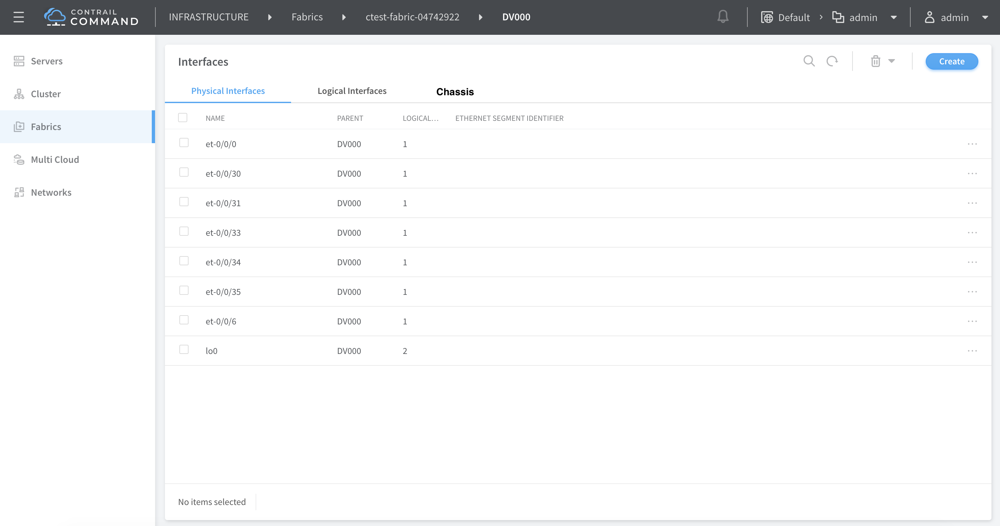
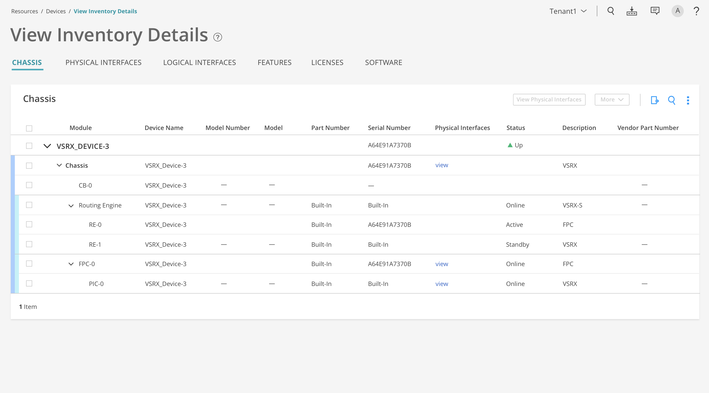

# 1. Introduction
Junos devices display a list of all Flexible PIC Concentrators (FPCs) and 
PICs installed in the router or switch chassis, including the hardware version
level and serial number. This story involves providing this information for the 
Physical Routers in Contrail Command UI.

# 2. Problem statement
Currently user cannot view the hardware inventory information in the UI.
User should be able to view the details of the 'show chassis hardware' command
in the UI and also be able to pull these latest hardware details from the device
on demand.

# 3. Proposed solution
During the on-boarding of the fabric, hardware inventory for the device will
be fetched and saved in the DB. The User will be able to view this detail for 
the Physical router in the UI. Also User will be able to click a button to 
pull this information from the device in real time. 

The solution Will be vendor agnostic. To support other vendors all the user
will have to do is add jinja parsing  for the new vendor command ouput and 
cater to the generic schema.

# 4. API schema changes
A new hardware-inventory will be added as a child to the existing
 physical-router object.

<xsd:element name="hardware-inventory" type="ifmap:IdentityType"/>
<xsd:element name="physical-router-hardware-inventory"/>
<!--#IFMAP-SEMANTICS-IDL
          Link('physical-router-hardware-inventory',
          'physical-router', 'hardware-inventory', ['has'], 'optional', 'CRUD',
          'Hardware Inventory on a physical router.') -->
<xsd:element name="hardware-inventory-inventory-info" type="xsd:string"/>
<!--#IFMAP-SEMANTICS-IDL
          Property('hardware-inventory-inventory-info', 'hardware-inventory', 'optional', 'CRUD',
              'chassis inventory info of the physical router. Stored as json string. Will be used to render chassis hardware details in UI') -->

A new job template hardware_inventory_template will be added for getting the
hardware inventory from device.
There will be two schema files introduced since we support the hardware inventory fetch as both a standalone job as well part of the ztp workflow.

The input and output schema for the hardware inventory data is provided below:
hardware_inventory_info_schema.json - This schema is used to validate the output that is obtained after processing the hardware inventory info from the device. This makes the workflow vendor agnostic.

{
  "input_schema": {
    "title": "Hardware Inventory Information",
    "$schema": "http://json-schema.org/draft-06/schema#",
    "type": "object",
    "minProperties":1
  },
  "output_schema": {
	"$schema": "http://json-schema.org/draft-07/schema#",
    "title":"Generic hardware inventory information output",
    "type":"object",
    "minProperties": 1,
    "additionalProperties": false,
    "properties": {
      "hardware_inventory_inventory_info": {
        "type": "array",
        "title": "Hardware Inventory Output",
        "items": {
          "$id": "#/items",
          "type": "object",
          "title": "List of hardware inventory info",
          "required": [
            "module",
            "model",
            "model_number",
            "part_number",
            "version",
            "serial_number",
            "description",
            "parent_module"
          ],
          "properties": {
            "module": {
              "type": "string",
              "title": "The Module Name",
              "default": "",
              "examples": [
                "chassis"
              ]
            },
            "model": {
              "type": "string",
              "title": "The Model Name",
              "default": ""
            },
            "model_number": {
              "type": "string",
              "title": "The Model Number",
              "default": ""
            },
            "part_number": {
              "type": "string",
              "title": "The Part Number ",
              "default": ""
            },
            "version": {
              "type": "string",
              "title": "Module Version",
              "default": ""
            },
            "serial_number": {
              "type": "string",
              "title": "The Module Serial Number",
              "default": "",
              "examples": [
                "VF3717350288"
              ]
            },
            "description": {
              "type": "string",
              "title": "Module Description",
              "default": "",
              "examples": [
                "QFX5100-48S-6Q"
              ]
            },
            "parent_module": {
              "$id": "#/items/properties/parent",
              "type": "string",
              "title": "If the current Module is a subset of another Module",
              "default": "",
              "examples": [
                "FPC 0"
              ]
            }
          }
        }
      }
     }
   }
}

hardware_inventory_schema.json - This is the schema file used to run the worklfow as a standalone job.

{
  "input_schema": {
    "title": "Hardware Inventory Information",
    "$schema": "http://json-schema.org/draft-06/schema#",
    "type": "object",
    "minProperties":1
  },
  "output_schema":{
      "$schema":"http://json-schema.org/draft-06/schema#",
      "title":"Generic Job Output",
      "type":"object",
      "properties":{
         "status":{
            "type":"string",
            "enum":[
               "Success",
               "Failure",
               "Timeout"
            ],
            "description":"Result status of the job"
         },
         "message":{
            "type":"string",
            "description":"Should capture a summarized error message in case of Failures."
         },
         "results":{
            "type":"object",
            "description":"JSON object holding the job specific output details"
         }
      },
      "required":[
         "status"
      ]
   }
}

# 5. Alternatives considered
N/A

# 6. UI changes / User workflow impact
The User will be able to view the hardware/chassis details in a tabular format
in a newly added tab in the page where the Physical interface and Logical
interfaces are currently displayed. The page will also have a action button 
to update the hardware data in realtime

The below screenshot captures the addition of a new tab to the page in Contrail
Command UI where the Physical Router details are displayed.

The below screenshot is a mock up dipicting the tabular representation of the
hardware inventory

# 7. Notification impact
N/A

# 8. Provisioning changes
N/A

# 9. Implementation
The major implementation modules include:
1) Playbook to read the hardware details from the device using the 
'show chassis hardware' command. This playbook will fetch the data from the 
device in json format and process it to meet the defined schema and 
save the JSON in DB.
2)A new job template hardware_inventory_template will be added for getting the
hardware inventory from device. A juniper specific jinja  will be added to
parse the 'show chassis hardware' command. For supporting others vendors,
vendor specific templates can be added on, thus supporting a vendor agnostic
behavior.
3) Upon request from user to fetch the hardware information in real time,
the same playbook will be used to update the chassis data in DB

# 10. Performance and scaling impact
N/A

# 11. Upgrade
N/A

# 12. Deprecations
N/A

# 13. Dependencies
N/A

# 14. Testing
Will capture the testing plan in a separate document.

# 15. Documentation Impact
The feature will have to be documented

# 16. References
JIRA story : https://contrail-jws.atlassian.net/browse/CEM-37
JUNOS documentation: https://www.juniper.net/documentation/en_US/junos/topics/reference/command-summary/show-chassis-hardware.html
