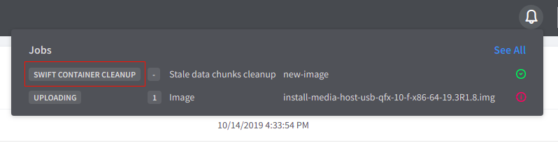
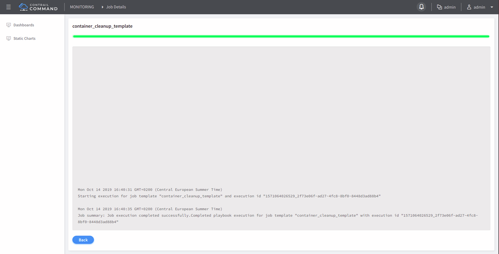
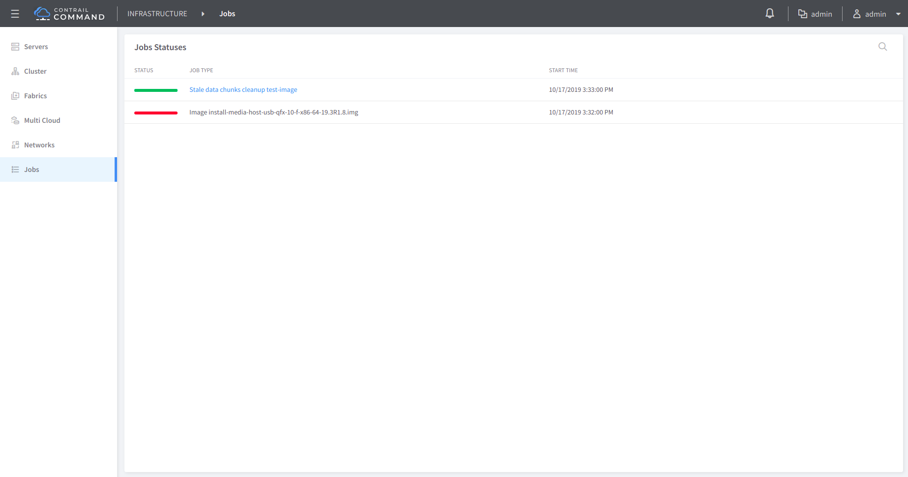

# 1. Introduction
None
# 2. Problem statement
There have been several issues with the current image management workflow.  Below is a brief description of the issue that is in a scope of the story.

- When a particular image upload fails, since the file is uploaded in chunks, a clean up logic needs to be called for that particular file to free up the container from stale chunks thereby avoiding unnecessary usage of container space. 

Jira story: [CEM-7525](https://contrail-jws.atlassian.net/browse/CEM-7525)
# 3. Proposed solution
For the **1st bullet**, whenever a image upload fails for whatever reason, the UI should immediately trigger swift container cleanup job right after device-image object is removed from a database.

# 4. Alternatives considered
None
# 5. API schema changes
None
# 6. UI changes

### **1st bullet**

#### a) The user can move to Job Details page by clicking at ring bell and choosing **SWIFT CONTAINER CLEANUP** from the list.

The user is able to see the cleanup job logs.

#### b) The user can move to Job Details page by clicking at ring bell and then **See All**.

The user is able to see the cleanup job status. By clicking at **Stale data chunks cleanup**, the user is able to see the cleanup job logs.

# 7. Notification impact
None
# 8. Provisioning changes
None
# 9. Implementation
#### API calls being made:

The payload for cleanup job:

endpoint: `/config/execute-job`

    {  
       "job_template_fq_name":[  
          "default-global-system-config",
          "container_cleanup_template"
       ],
       "input":{  
          "fabric_fq_name":[  
             "default-global-system-config",
             "default-fabric"
          ],
          "container_name":"contrail_container",
          "filename":"new-image"
       }
    }

# 10. Performance and scaling impact
None
# 11. Upgrade
None
# 12. Deprecations
None
# 13. Dependencies
None
# 14. Security Considerations
None
# 15. Testing
None
# 16. Documentation Impact
None
# 17. References
