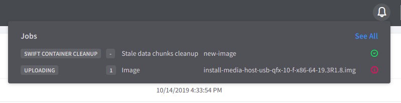
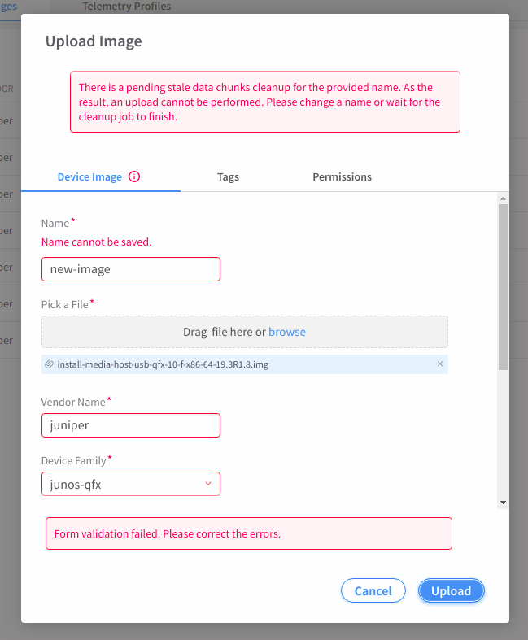

# 1. Introduction
None
# 2. Problem statement
There have been several issues with the current image management workflow.  Below is a brief description of the issues that are in a scope of the story.

- We should have a retry logic implemented based on failures. The backend workflow for container cleanup is already available. When a particular image upload fails, the clean up logic could be called for that particular file and the upload can be retried again.
- The other challenge we have right now is if the user uploads an image with the same filename, for which the cleanup task is going on. Having both upload and cleanup job working simultaneously for particular image name will definitely cause inconsistencies.

Jira story: [CEM-7525](https://contrail-jws.atlassian.net/browse/CEM-7525)
# 3. Proposed solution
For the **1st bullet**, whenever a image upload fails for whatever reason, the UI should immediately trigger swift container cleanup job right after device-image object is removed from a database.

For the **2nd bullet**, whenever a user tries to upload a new image, the UI should validate first if there is a pending cleanup job for a given image name. If so, an error message should pop up with a brief explanation why the user is stopped from uploading an image.

# 4. Alternatives considered
None
# 5. API schema changes
None
# 6. UI changes

### **1st bullet**

The user can move to Job Details page by clicking at ring bell and choosing **SWIFT CONTAINER CLEANUP** from the list.

The user is able to see the cleanup job logs.

### **2nd bullet**

If there is a pending cleanup job for a given image name, the user should be stopped from uploading a new image.

# 7. Notification impact
None
# 8. Provisioning changes
None
# 9. Implementation
#### API calls being made:

The payload for cleanup job:

endpoint: `/config/execute-job`

    {  
       "job_template_fq_name":[  
          "default-global-system-config",
          "container_cleanup_template"
       ],
       "input":{  
          "fabric_fq_name":[  
             "default-global-system-config",
             "default-fabric"
          ],
          "container_name":"contrail_container",
          "filename":"new-image"
       }
    }

# 10. Performance and scaling impact
None
# 11. Upgrade
None
# 12. Deprecations
None
# 13. Dependencies
None
# 14. Security Considerations
None
# 15. Testing
None
# 16. Documentation Impact
None
# 17. References
