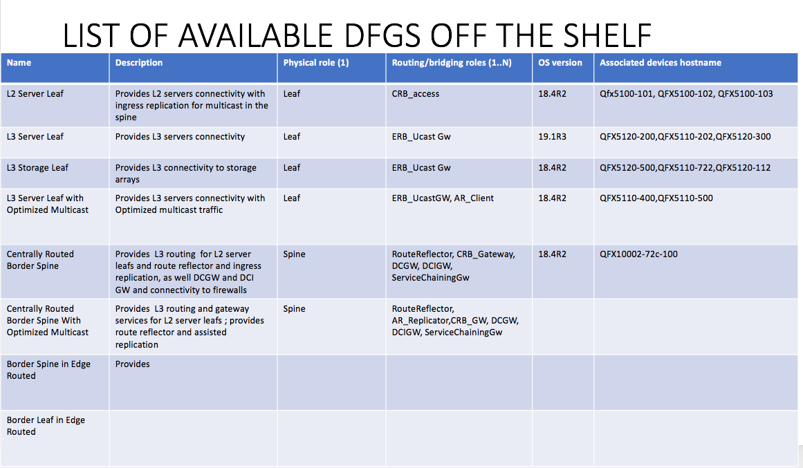
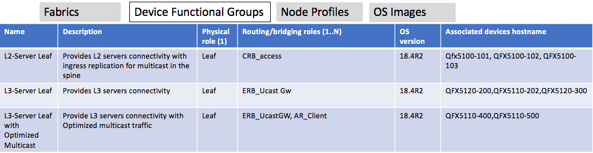

# 1. Introduction
A new object, called Device Functional Group, is introduced to apply
certain properties to a user-specified group of devices during ZTP and RMA.

# 2. Problem statement
Contrail fabric management currently provides pre-defined Node Profiles to
provide certain properties, such as supported routing-bridging groups,
for a specified class of devices. Node Profiles are defined on a
per-vendor-family basis, e.g. Juniper QFX 5K.
For certain operations, like OS version upgrade and role assignment,
we want the ability to assign properties to a user-defined group of devices
instead of a grouping defined by Node Profiles. These properties can be
applied during ZTP or device RMA.

# 3. Proposed solution
We introduce a new object, Device Functional Group (DFG), to contain os_version,
physical_role, rb_routing_roles in the first phase. Other attributes can
be added in future releases. A certain set of pre-defined DFGs
will be provided in hopes of covering most typical scenarios. We will also
provide the ability to add new DFGs on the fly.

Device Functional Groups will initially be used only during ZTP and RMA,
but can be extended for other uses in the future. DFGs must be configured
before ZTP or RMA is executed. In order for DFGs to be used,
the user is required to specify DFG name in the Device Info input file
during fabric creation in the UI.

Here are the steps to using Device Functional Groups during ZTP:

1) Create new DFGs via UI (optional). Specify an os_version, physical_role
(leaf, spine) and routing-bridging-role(s) via pull down menus. Note that
there will be several default DFGs provided. See details in later sections.
2) User edits the Device Info file given during ZTP. A new optional per-device attribute
called "Device Functional Group" can be specified for each device to give
the name of the DFG to be used during ZTP or RMA activation.
3) User can also add a "Route-Reflector' flag in the devcice info file if he wants to 
include Route-Reflector as a rb role for that DFG on the fly.
4) During the early stages of ZTP, the Device Info file is parsed and the
DFGs are validated to exist. If any DFG does not exist, an error is thrown.
5) For each device with a DFG specified in the Device Info file, a reference
is drawn between the device's physical-router object and device-functional-group object.
6) During the image upgrade step of ZTP, if a device has a device-functional-group
reference and a device-functional-group-os-version is specified, and the
os-version exists for that family,
then the image is upgraded to that version. Otherwise, the fabric-wide os-version
is used, or none is used for image upgrade.
7) As the last step of ZTP, a new role assignment dfg job playbook will now be called.
For each device which has device-functional-group->device-functional-group-physical-role
and/or device-functional-group->device-functional-group-routing-bridging-roles defined,
the new playbook writes data to the role assignment template annotations
of the fabric. A dictionary consisting information about the device, the physical role
and the routing bridging role that is user selected based on the dfg specified is written.
UI will read this dictionary and preapre the device to be assigned the 
specified roles. After ztp, when the user clicks on role assignment, all those devices 
for which the use had specified DFGs in the beginning will be auto-populated with 
physical and rb roles. The user will have the ability to modify them.   
If the roles are not specified, then the existing behavior is applied where
the user is given the option to apply roles manually.

Here are the steps to using Device Functional Groups during RMA:

1) The device physical-router object should already have a reference to DFG.
2) During the image upgrade step of RMA activation, if a device has a device-functional-group
reference and a device-functional-group-os-version is specified, and the
os-version exists for that family,
then the image is upgraded to that version. Otherwise, the fabric-wide os-version
is used, or none is used for image upgrade.
3) Since the physical-router is already assigned roles during onboarding,
there is no need to use device-functional-group->device-functional-group-physical-role
or device-functional-group->device-functional-group-routing-bridging-roles
during RMA activation. The roles and associated overlay configuration are
already getting pushed during RMA activation.

Note that modifying a DFG will not automatically apply these changes to group members.
The DFG settings are only applied during ZTP.

# 4. User workflow impact

1) The user will optionally configure a Device Functional Group before
onboarding a fabric.
2) The user will be required to edit the Device Info file given during ZTP.
A new optional per-device attribute called "device_functional_group" can
be specified for each device to give the name of the DFG to be used during
ZTP or RMA activation.

# 5. API schema changes

#### Device Functional Group Object
There will be a new object with the following schema definition:

```
<xsd:element name="device-functional-group" type="ifmap:IdentityType"
    description="Device functional group is used to group together any selected list of devices for the purpose of assigning identical attributes. For example, os-version, physical-roles, rb-roles"/>

<xsd:element name="project-device-funtional-group"/>
<!--#IFMAP-SEMANTICS-IDL
         Link('project-device-functional-group',
              'project', 'device-functional-group', ['has'], 'optional', 'CRUD',
              'List of device functional groups in this project.')-->

<xsd:element name="device-functional-group-description" type="xsd:string"/>
<!--#IFMAP-SEMANTICS-IDL
          Property('device-functional-group-description', 'device-functional-group', 'optional', 'CRUD',
              'Description of the functional group stating the functionality the devices would get if assigned to this group') -->

<xsd:element name="device-functional-group-os-version" type="xsd:string"/>
<!--#IFMAP-SEMANTICS-IDL
          Property('device-functional-group-os-version', 'device-functional-group', 'optional', 'CRUD',
              'OS version for devices in this group. If set, it is the first choice for device image upgrade during ztp. If not set, fabric-os-version is used') -->

<xsd:element name="device-functional-group-routing-bridging-roles" type="RoutingBridgingRolesType"/>
<!--#IFMAP-SEMANTICS-IDL
          Property('routing-bridging-roles', 'device-functional-group', 'optional', 'CRUD',
              'Routing-bridging role (e.g. CRB, ERB, etc.), used by the device manager to provision physical router, for e.g device manager may choose to configure physical router based on its role.') -->

<xsd:element name="device-functional-group-physical-role"/>
<!--#IFMAP-SEMANTICS-IDL
          Link('device-functional-group-physical-role', 'device-functional-group', 'physical-role', ['ref'], 'optional', 'CRUD',
             'Physical role assigned to all physical routers which are members of this device functional group') -->

<xsd:element name="physical-router-device-functional-group"/>
<!--#IFMAP-SEMANTICS-IDL
          Link('physical-router-device-functional-group',
             'physical-router', 'device-functional-group', ['ref'], 'optional', 'CRUD',
             'Device functional group that this physical-router belongs to.') -->
```


# 6. Implementation

- Pre-defined DFGs will be added to predef_payloads.py
to automatically assign roles to devices if provided in the Device Info file.
- Design a new playbook to write to the role_assignment template annotations.
- Use existing per-fabric os-version logic, where possible, to extend to
using DFG os-version.

### Pre-Defined Device Functional Groups




# 7. UI Changes
(screen samples TBD, pending UX design)

We expect to display a new "Device Functional Groups" tab when clicking
Fabrics, at the same level as Fabrics, Node Profiles and OS Images.
The Device Functional Group page will display a list of DFGs with these
attributes:

1) Name
2) Description
3) physical role
4) routing-bridging roles (list)
5) OS version
6) Associated device hostnames



When selecting a particular DFG, the description, physical role, routing-bridging roles,
and OS version should all be editable. The physical role, routing-bridging roles,
and OS version fields should be pull-down menus.

The user should be able to create new Device Functional Groups from the UI.
UI needs to create a reference between the physical role and the DFGs for custom
created DFGs.

UI should read the value of the fabric annotations for role assignemnt template 
and pre-populate the assign roles page with the device list along with physical
and routing bridging roles.  


# 8. Testing
(Insert link to test plan here)

# 9. Documentation Impact

