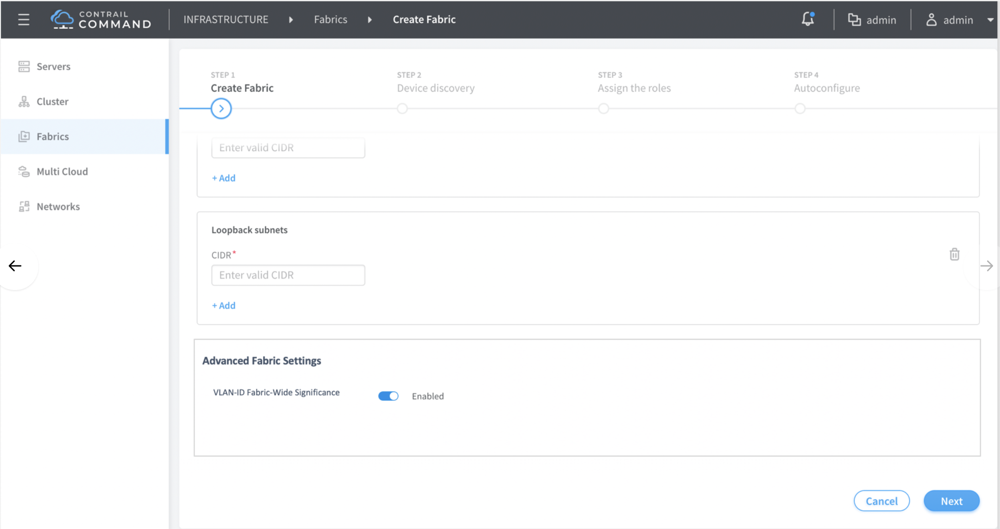

# 1. Introduction
Enterprise-style configuration and SP-style configuration (Service Provider configuration)
refer to particular types of configuration methodologies used on some Juniper devices. 
In this document, we focus on enterprise-style configuration for
a CRB-Access role (Central Bridging Routing access role) on QFX devices.

# 2. Problem statement
As of today Contrail only supports SP-style configuration for CRB-access
on QFX devices. We want to introduce the additional option of configuring
these devices in an enterprise style more in line with what enterprise
customers prefer. We want to provide this option on QFX5100, QFX5110, QFX5120 
and other QFX 10K platforms.

We want to provide the option of configuration using either enterprise-style
or SP-style on a per-fabric basis in the initial release of this feature.

# 3. Proposed solution

1) Provide a new overlay_evpn_access jinja template for enterprise-style 
CRB access configuration.

2) Provide a fabric-level boolean checkbox in the UI to select between enterprise-style
and SP-style configuration. Enterprise-style will be the default.

Note: The user will not be able to modify the enterprise-style flag once configured.
After being selected during fabric creation, the setting can only be changed
by recreating the fabric.

# 4. User workflow impact
The following screenshots capture the user-visible changes

#### - Select Fabric Configuration Style



#### - Select Port Configuration Style

(Future release)

# 5. Alternatives considered
(None)

# 6. API schema changes
The fabric object will have the following schema additions:

- New 'enterprise_style' boolean field added to fabric_onboard_template and existing_fabric_onboard_template
 with these values:
  
  a) True: Uniform vlan mapping (Enterprise-style) (default)

  b) False: Flexible per-port vlan mapping (SP-style)  

```
{
  "input_schema": {
    "title": "fabric info",
    "$schema": "http://json-schema.org/draft-06/schema#",
    "type": "object",
    "additionalProperties": false,
    "properties": {
        ...
      "enterprise_style": {
        "type": "boolean",
        "default": true,
        "description": "True if enterprise style, false if sp-style configuration"
      }
    }
  },
```


# 7. UI changes
See section 4 "User Flow Impact".


# 8. Notification impact
(None)

# 9. Provisioning changes
(None)

# 10. Implementation

## 10.1 Data model changes
- New fabric.fabric_enterprise_style attribute to select between enterprise-style
and sp-style configuration

## 10.2 Jinja template configuration changes
- An alternate overlay_evpn_access jinja template will be called when using enterprise-style config.

- Sample output:

```
set groups contrail_overlay_evpn_access interfaces ge-0/0/0 mtu 9192

set groups contrail_overlay_evpn_access interfaces ge-0/0/0 unit 0 family ethernet-switching interface-mode trunk

set groups contrail_overlay_evpn_access interfaces ge-0/0/0 unit 0 family ethernet-switching vlan members BD-10



set groups cfg_group interfaces ge-0/0/0 native-vlan-id 10



set groups contrail_overlay_evpn_access vlans BD-10 vlan-id 10

set groups contrail_overlay_evpn_access vlans BD-10 vxlan vni vni

set groups contrail_overlay_evpn_access protocols evpn multicast-mode ingress-replication

set groups contrail_overlay_evpn_access switch-options vrf-target auto
```


# 11. Performance and scaling impact
(None)

# 12. Upgrade
(None)

# 13. Deprecations
(None)

# 14. Dependencies
(None)

# 15. Testing

## 15.1 Acceptance Tests
(TBD)

## 15.2 Feature Tests
(TBD)

# 16. Documentation Impact
Requires mention of UI boolean to select between configuration styles

# 17. References

# 18. Issues
