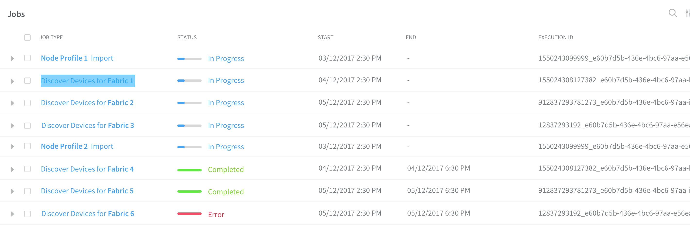

# 1. Introduction
Contrail fabric jobs and transactions will be displayed in Contrail Command
in a job summary page. The ability to display detailed job information as well
as execute job operations, such as abort, is also provided.

# 2. Problem statement
Contrail fabric management currently provides some form of job status for jobs
or transactions which have been initiated in Contrail Command. We can show
job percentage progress and job completion status. But we have no way to log
into a UI and retrieve a job summary of all active and completed jobs.
We also have no way of showing job status for supplemental device config push
jobs which are not started by Contrail Command.

# 3. Proposed solution
The Contrail controller will provide a new STAT analytics table which can be
queried from Contrail Command. The new StatTable.JobLog.log_entry table will
provide the ability to query for job summary information in a specified time period.
By providing a single query/response, the summary page can be updated quickly
and efficiently. To retrieve detailed job information, aditional queries will
be necessary.

The job summary information provided is as follows:
- Description
- Status
- Execution_id
- Fabric_name
- Device_name
- Percentage_complete
- Timestamp

The detailed job information provides the following fields:
- Job message
- Job details

## Query Job Summary
To retrieve the job summary information listed above, send
POST to http://{analytics-ip}:8081/analytics/query
with the following input.
 
To query log_entry for summary page, it will look something like this:
 
        select = [
                  'T',
                  'log_entry.description',
                  'log_entry.status',
                  'log_entry.execution_id'
                 ]
 
        sort = [
                'T'
                'log_entry.execution_id'
               ]
 
        wfilter = [
            [{
                'name': 'log_entry.status',
                'value': 'STARTING',
                'op': 1
            }],
            [{
                'name': 'log_entry.status',
                'value': 'SUCCESS',
                'op': 1
            }],
            [{
                'name': 'log_entry.status',
                'value': 'FAILURE',
                'op': 1
            }]
        ]
 
        query = {
            'start_time': 'now-{}'.format(time_window),
            'end_time': 'now',
            'select_fields': select,
            'sort_fields': sort,
            'table': 'StatTable.JobLog.log_entry',
            'where': wfilter
        }
 
Note that in the WHEN statement above the wfilter value is an OR operation, as designated by [] around each entry in the list.
Without these inner brackets, it is an AND statement. It is possible to combine AND and OR statements.
  
 
To query log_entry for one job:
 
        <starttime> is timestamp of start_log entry
        <end_time> is 'now' or timestamp of end_log entry
 
        select = [
                  'T',
                  'log_entry.description',
                  'log_entry.status',
                  'log_entry.execution_id',
                  'log_entry.message',
                  'log_entry.percentage',
                  'log_entry.fabric_name',
                  'log_entry.device_name',
                 ]
 
        sort = [
                'T'               
               ]
 
        wfilter = [
            {
                'name': 'log_entry.execution_id',
                'value': <exec-id>,
                'op': 1
            },
        ]
 
        query = {
            'start_time': '<end_time>-<start_time>',
            'end_time': '<end_time>',
            'select_fields': select,
            'sort_fields': sort,
            'table': 'StatTable.JobLog.log_entry',
            'where': wfilter
        }
 
- Note that for each completed job, there will be 2 results. This is how you get the job_start_time and job_end_time.
 
- Assuming that start_log is when status=STARTING, and end_log is when status={SUCCESS or FAILURE}
    - If receive start_log entry and end_log entry, job is completed
    - If receive start_log entry but no end_log entry, start polling UVE like today
    - If don't receive start_log entry, filter out end_log entry
 
- Newly started jobs need to be detected and displayed after the initial query. 
So we need to poll every N seconds with a query that either
    - queries between start_time=now-{window-size} and end_time=now OR
    - queries with a sliding time window, with start_time=previous_end_time and end_time=now
 
## Query Job Progress
For in-progress jobs, there is currently no change from the current methodology used by the UI.
Send POST request to http://{analytics-ip}:8081/analytics/uves/job-execution /{fabric_fqname:job_template_fqname}
The response will contain current percentage complete and status.

## Abort Job
For in-progress jobs, the UI can send an abort-job request as specified here: 
 https://github.com/Juniper/contrail-specs/blob/master/fabric_abort_job.md

# 4. User workflow impact

#### - Job Summary and History Page

1) At any time, the user can log into UI and query a job status and history page
for a selected time period
2) The user can click on any job and view detailed messages for that job,
including any error messages for failed jobs
3) The user can see the current in-progress percentage
4) The user can select any in-progress job and abort the job

# 5. API schema changes

(None)

# 6. Implementation

- A new STAT table called StatTable.JobLog.log_entry will be defined in the backend
- A new page will be shown in the UI to display job status and history

# 7. UI Changes

# 8. Testing

# 9. Documentation Impact

