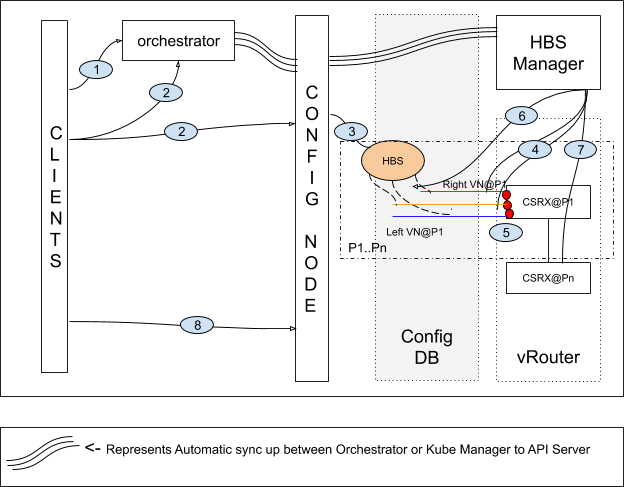
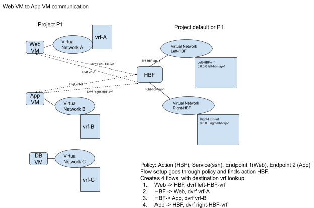

# Host Based Firewalling with cSRX

## 1. Introduction
### Contrail Security

Contrail security was introduced in 4.1 release, Contrail security uses tags, application policy sets, firewall policies and other objects to configure security policies. Check the following blueprint for details.

[https://github.com/Juniper/contrail-specs/blob/master/fw\_security\_enhancements.md][https://github.com/Juniper/contrail-specs/blob/master/fw_security_enhancements.md]

## 2. Problem statement
Contrail natively doesn&#39;t support Next-generation Firewall (NGFW) functions. This feature addresses the gap by integrating third-party firewalls. Contrail does support service chaining functions with any third-party firewalls. However, Service Chaining constructs are limited, support only chaining between virtual networks(Inter), don't support intra-network. Moreover, Service Chaining constructs don't understand tags and they are tied with virtual network constructs.

## 3. Proposed solution
###NGFW

NGFW integration will support tag based firewall configuration. NGFW integration got three types of firewall models. Host based firewall (HBF), service chain and physical FW. This design addresses only HBF.

NGFW integration needs, license management, and automatic provisioning of supported firewall models, registration of NGFW controller and lifecycle management of NGFW instances.

Single management interface for both Contrail and NGFW management is desired, but 5.1.x release will have two management interfaces. Contrail management interface to configure intent based policies up to L4 and NGFW management (SD) to configure NGFW functions with contrail defined security objects (mainly tags and tenants).

Later releases will support a single management interface by Contrail Command and also Contrail security FWP language enhanced with NGFW features configuration. Tag based security policy to redirect traffic towards to NGFW. NGFW includes features like IPS, IDS, AV, Malware detection and many more.

**Focus of this document is to go over HBF functions and use cases supported for contrail side of development.**

### Host based firewall (HBF)

HBF gives an ability to support NGFW functions close to workloads. NGFW can be vSRX/cSRX or any third party firewall. Architecture should support customer choice NGFW vendor. But, this effort will be mainly focus on releasing it with cSRX and its corresponding management plane (Security Director).

### Multi tenancy

NGFW (HBF) instance may support multi-tenancy, in those cases one instance of NGFW per compute node would be sufficient. Other cases, would require multiple instances of NGFW per compute node minimum an instance per tenant. There could be another extreme that, a cSRX instance per port (It is not in scope for this effort). cSRX doesn&#39;t support multi tenancy, hence we choose support one cSRX instance per tenant in a compute node. Multiple instances per tenant in a compute node will be addressed in later releases.

Multi tenancy feature needs an identifier for tenants for configuration at NGFW controller and also at data path to distinguish tenants. We will be using vlan id as identifier and communicated to NGFW controller. Since we are using vlan id, there is a limit of 4k tenants/projects for given cluster from Contrail.

### Overlapping IP addresses

Physical NGFW (SRX) supports multi-tenancy. Firewall domains are created for tenant in SRX and supports overlapping addresses across tenants. Virtual SRXes doesn&#39;t support multi tenancy. vSRX got a feature to support it in later releases, but not for cSRX.  NGFW doesn&#39;t support overlapping addresses for a tenant. This feature introduces restriction to support overlapping ipaddress ranges in a given tenant. Where as, across tenants overlapping addresses will be supported.

### Firewall operation modes

Firewalls typically support three modes of operation, routing, transparent and secure wire (a.k.a bump in the wire).

- Routing - Acts as router
- Transparent - it is l2 mode or bridging mode
- Secure wire - It ties two interfaces in secure wire mode, there is no change in the packet including mac-address, when packet is sent out on connected interfaces.

This feature uses cSRX in secure wire mode.

### NGFW to Contrail

NGFW controller learns about tenants and tags from Contrail Controller. Both Contrail and NGFW management interfaces use contrail defined tags.

Interfaces can be tagged at Contrail, tags and virtual network objects doesn&#39;t have any binding.

NGFW controller should understand, whether tags are tenant scoped or global. NGFW controller also gets information about projects and tags to port mapping. NGFW controllers uses tenant and tag to port mapping to configure cSRX policies.

HBF feature is bump in wire, based on policy configuration

## 4 HBF Use Cases

All these use cases are with respect to tag based Contrail Security framework.

1. HBF action configuration option for Contrail Security firewall rule configuration (Part of an action).
2. HBF to support virtual to virtual workload policies. BMS to BMS and BMS to Virtual tag based policies are not supported for this release.
3. Tag based policies doesn&#39;t support mirror action, hence supporting HBF action along with mirror action will not be supported.
4. Knob to do HBF at source or source/destination traffic endpoints. (optional)
5. Fabric network supporting HBF (vhost traffic requiring HBF feature) will be supported.
6. Current floating IP and all other features like LB/SNAT/DNAT should work.
7. Existing Networking polcies should work.
8. This feature should work in contrail supported orchestrators (openstack, vmware compute VM, container based orchestrators and BMS combinations)
  1. It is important use case test with VMware/Cloud with cSRX containers
9. Packet mode interfaces doesn&#39;t participate in flow creation, hence it is not subjected to HBF. HBF traffic streeting happens via policy, which is used to create flows.
10. HBF is currently not supported with DPDK variant of vRouter
11. HBF is currently not supported for cross-tenant traffic

### 4.1 HBF Feature Support for Projects

Contrail cluster supports openstack, k8s and vmware orchestrators for virtual workloads. Contrail cluster can support all at the same time, but there are limitations via Contrail Command UI to provistion all in orchestrators.

HBF feature design should support all orchestrators in a given cluster, but it will be supported in phased manner. First phase supports kubernetes orchestrated projects and subsequent phases will support other orchestrator projects.

## 5 Policy language at high level

### 5.1 Contrail Policy

Tier=Web -> Tier=App all traffic to HBF

Tier=Web -> Tier=App service SQL traffic to HBF

## 5.2 NGFW policy

Tier=Web -> Tier=App service HTTP to malware detection

Tier=Web -> Tier=App service HTTPs to IPS

Tier=Web -> Tier=App service SQL traffic to AV

Contrail FWP framework supports action as HBF. HBF action will send traffic to NGFW instance assigned for that project/tenant.

## 6 Config Node

Above diagram explains about each process involved in setting HBS object and its associated objects like Right-VN/Right-VMI, Left-VN/Left-VMI and Mgmt-VN/Mgmt-VMI and finally Host based services VM/Docker.

###  6.1 New Object: HBS

A new object named HBS (Host Based Services) would be added to our data model. This object will have references to Left-VN, Right-VN and Mgmt-VN which inturn will have one VMI per each VNs, Left-VMI, Right-VMI and Mgmt-VMI respectively. These VMIs would be three VMIs of the Docker or VM running the Host Based Services software, for instance, Host based services of type Firewall, cSRX. HBS object is a generic object with type. Current implementation is for HBS object with type = firewall.

HBS object would be created in the Config DB by API server when user enables HBS option in the user project. HBS object and these VNs, VMI and Docker container will all be hosted in the same project or dedicated project

### 6.2 Series of Events to setup HBS Object in Config Nodes

Step 1: User creates a Project in the orchestrator, say Project-1. This project is automatically synced to Config DB

Step 2: User creates HBS object at Contrail via API-server. This object would be created and maintained in Config DB.

Step 3: HBS object is created in Config DB. HBS-Manager (Kube-Manager or Operator framework) is expected to automatically start a series of events to create

Step 4: Right VN, Left VN and Mgmt VN

Step 5: Right VMI, Left VMI and Mgmt VMI

Step 6: Ref update on HBS object, to create refs from HBS object to above three VNs. This ref will have a property name called type = Left-VN/Right-VN/Mgmt-VN and this property can be used to identify VN type. There is no special property in the VN to identify its direction.

Step 7: Start the Host Based services image based on the HBS object type. Current implementation is for HBS type = firewall.

This completes the setup required for using HBS in the Contrail Security Policies.

Contrail security policies should be able to create HBS action independent of the above process, as two steps are orthogonal steps.

Step 8: At this point of time, user should be able to use a new action named - HBS in their contrail security policies.

### 6.3 HBS object Lifecycle

HBS object will be created by API server in Config DB on project with HBS option enabled. This triggers a series of automation by HBS-Manager (or operator framework) to create VNs/VMIs and spawns security docker image as well as refs from HBS object to both VNs  in the project  where HBS is enabled or in a dedicated project

Likewise, when HBS object is disabled in the project, API server deletes the HBS object from Config DB which inturn triggers HBS-Manager (or operator framework) to remove Security Docker/VM, VMIs and VNs and refs.

HBS object, VNs, VMIs and Security Docker/VM can live in the same user project or in its dedicated project. Security Docker/VM is created per project per compute.

### 6.4 HBS Quota

HBS object is created per project per Compute node. This may resulted in several number of security images running in the cluster depending upon the number of Projects and Compute nodes. For instance, for 10 project on a 10 compute node can result in 100 instances running in a cluster.To limit this number of instances, Config will provide an option at global system config to specify number of HBS enabled projects in a given cluster.

## 7 UI

Cluster level quota is required to limit the number of projects to enable HBF feature.

Project level knob to enable/disable or quota for HBF

Contrail security policy action enhancements to support HBF, add enable/disable HBF or action as HBF.

## 8 Control Node

HBF\_Left and HBF\_Right are treated like any other networks, and not seeing any code changes.

## 9 Agent/vRouter

###  9.1 HBF Instances, VNs and Interfaces

One HBF instance is created for each tenant with HBF enabled. Two data interfaces, called HBF left and right interfaces, are created for each HBF instance. Two VNs named &quot;HBF-LEFT&quot; and &quot;HBF-RIGHT&quot; are created under the tenant&#39;s project. The left and right interfaces are assigned respectively to &quot;HBF-LEFT&quot; and &quot;HBF-RIGHT&quot; VNs. The _vif_ objects corresponding to HBF left and right interfaces are marked with a flag to indicate that they are HBF interfaces. One management interface also created with specified management VN.

###  9.2 Approach

This approach embeds the flow id in L2 header of the packet sent to HBF instance. HBF instance is expected to send back the packet without modifying the l2 header.

#### 9.2.1 Assumptions

1.         HBF instance does not modify the L2 header of the packets

2.         vRouter&#39;s VMIs work in promiscuous mode (Is this assumption for HBF VMIs ?)

3.         Packets generated by HBF are sent back to vRouter by just interchanging source and destination MACs

#### 9.2.2 HBF Flows

Defined as all flows that have HBF flag set.

#### 9.2.3 Agent/vRouter

vRouter&#39;s vif object is enhanced to store all vif and AAP (IP, MAC) pairs. Agent programs vRouter with this information.

When adding a vif to vRouter, Agent additionally sends the HBF left and right interface indices to vRouter. From this information, vRouter maintains a map of VRF to HBF left and right interfaces. Agent obtains a VMI&#39;s project via VMI à VN à Project config path. From the project it obtains HBF interfaces via Project à &quot;HBF-LEFT&quot;/&quot;HBF-RIGHT&quot; à HBF-interface config path.

#### 9.2.4 Flow setup

At the time of flow creation, Agent marks a flow as an HBF flow if a matching ACL has HBF action set. Agent also marks HBF flows with an &quot;HBF-interface&quot; flag that indicates if packets matching the flows are to be sent to HBF left (L) or HBF right (R) interface. The flag is set according to the table below.

|   | Destination: VMI | Destination: Fabric |
| --- | --- | --- |
| Source: VMI | L if source vif index \< dest vif indexElse R | L |
| Source: Fabric | R | - |

### 9.3 Datapath

#### 9.3.1 Packet Entering vRouter via a VMI

When a packet enters the Vrouter via a VMI and matches a flow marked with HBF flag, vRouter redirects the packet to the left interface of the tenant&#39;s HBF interface if the flow&#39;s HBF-interface flag is set to L. Otherwise, it sends the packet to HBF&#39;s right interface.

If the packet is being sent to HBF left interface, it encodes flow id as the source MAC address in packet&#39;s L2 header. In case of L3 VPN, it uses the HBF mac as the destination MAC. In L2 VPN case, it leaves the destination MAC as it is.

In addition to encoding the flow id in source or destination MAC field, a FROM\_VMI bit is also encoded in the MAC field (flow Id requires 32 bits of 48-bit MAC field) to indicate the packet source.

#### **9.3.2 Packet Entering vRouter via the Fabric Interface**

When a packet enters the vRouter via the fabric interface and matches a flow marked with HBF flag, Vrouter redirects the packet to the right interface of the tenant&#39;s HBF interface. The matching flow is expected to have its HBF-interface flag set to R. It uses flow id as the destination MAC address in packet&#39;s L2 header. If the incoming packet matches an AF\_INET NH, VRRP MAC is used as source MAC. If the matching NH is an AF\_BRIDGE NH, original source MAC is retained. In addition to encoding the flow id in destination MAC field, a FROM\_FABRIC bit is also encoded in the MAC field to indicate the packet source.

#### **9.3.3 Packet Entering vRouter via HBF Right Interface**

When a packet enters vRouter via an HBF right interface, vRouter uses the source MAC as flow index to get back the original flow. In case of l2 VPNs, it will restore the original source MAC from IP-to-MAC map of flow key-NH&#39;s vif using the flow&#39;s source IP. Vrouter skips HBF processing this time to avoid looping the packet back to HBF instance and continues with NAT, mirroring, service chaining etc.

#### **9.3.4 Packet Entering vRouter via HBF Left Interface**

When a packet enters the Vrouter via an HBF left interface, vRouter uses the destination MAC as flow index to get back the original flow. If FROM\_FABRIC bit is set, in case of l2 VPNs, it will restore the original destination MAC from IP-to-MAC map of flow key-NH&#39;s vif using the flow&#39;s destination IP. If FROM\_VMI bit is set and the flow&#39;s HBF-interface flag is R, the destination MAC is restored from IP-to-MAC map of reverse-flow&#39;s key-NH&#39;s vif using the flow&#39;s destination IP.

vRouter skips HBF processing this time to avoid looping the packet back to HBF instance and continues with NAT, mirroring, service chaining etc.

#### **9.3.5 ECMP**

In cases were a composite NH is being used a flow&#39;s key-NH, the flow&#39;s ECMP index indicates the leg of the composite NH to be used for routing the packet. The same data is used in case of HBF flows to obtain the correct vif (vif of the leg indicated by flow&#39;s ECMP index) from which the original source/destination MAC is restored.

### 9.4 Allowed Address Pair

#### 9.4.1 VMIs are configured to have the same AAP IP and packets use the VMI MACs as source

*VMI1:<IP1, MAC1, AAP-IP, AAP-MAC1>*
*VMI2:<IP2, MAC2, AAP-IP, AAP-MAC2>*
*Packets use <AAP-IP, MAC1> and <AAP-IP, MAC2>*

Flows from the two VMIs use the corresponding vif NH as flow key-NH. When a packet enters vRouter from HBF right/left interface, the flow id embedded in the source/destination MAC allows us to get back the original MAC address from IP-to-MAC map of flow key NH&#39;s vif.

#### **9.4.2 VMIs are configured to have the same AAP IP and packets use the corresponding AAP MACs as source**

*VMI1:<IP1, MAC1, AAP-IP, AAP-MAC1>*
*VMI2:<IP2, MAC2, AAP-IP, AAP-MAC2>*
*Packets use <AAP-IP, AAP-MAC1> and <AAP-IP, AAP-MAC2>*

Flows from the two VMIs use the corresponding vif NH as flow key-NH. When a packet enters vRouter from HBF right/left interface, the flow id embedded in the source/destination MAC allows us to get back the original source/destination MAC address from IP-to-MAC map of flow key NH&#39;s vif.

#### **9.4.3 One VMI configured with AAP**

*VMI:<IP, MAC, AAP-IP, AAP-MAC>*
*Packets use <IP, MAC> and <AAP-IP, AAP-MAC>*

Two flows are created. Flows from the two IP addresses use the same vif NH as flow key-NH. When a packet enters vRouter from HBF right/left interface, the flow id embedded in the source/destination MAC allows us to get back the original flow. Original source/destination MAC address is got back from IP-to-MAC map of flow key NH&#39;s vif.

#### **9.4.4 One VMI configured with AAP**

*VMI:<IP, MAC, AAP-IP, AAP-MAC>*
*Packets use <IP, MAC> and <IP, AAP-MAC>*

Only one flow is created with vif NH as flow key-NH. MAC index in the flow would the index of the MAC that triggered flow creation. When a packet enters vRouter from HBF right/left interface, the flow id embedded in the source/destination MAC allows us to get back the original flow. However, we cannot deterministically get back the original source/destination MAC from IP-to-MAC map of vif. This configuration is not expected.

#### **9.4.5 One VMI configured with AAP**

*VMI:<IP, MAC, AAP-IP, AAP-MAC>*
*Packets use <IP, MAC> and <AAP-IP, MAC>*

Two flows are created. Flows from the two IP addresses use the same vif NH as flow key-NH. When a packet enters vRouter from HBF right/left interface, the flow id embedded in the source/destination MAC allows us to get back the original flow. Original source/destinationMAC address is got back from IP-to-MAC map of flow key NH&#39;s vif.

### 9.5 Flow Changes

It is possible that while a flow Id is being carried in a packet to HBF instance, if the flow id gets released and gets allocated to a new flow. In this case, when the packet enters vRouter from HBF interfaces, the flow id would be not be pointing the flow the packet had matched when it was sent to HBF instance. This is a transient condition that would affect all packets that are in fight to HBF when the flow change occurs. To avoid this mismatch, the gen-id of the flow is embedded in the source/destination MAC along with the flow id. When a packet enters vRouter after its HBF instance visit, gen-id of the flow obtained from the flow-id is compared with the flow&#39;s gen-id. If they don&#39;t match, the packet is discarded.

### 9.6 Packets Generated by HBF Instance

Sometimes HBF instances generate and send back packets to the source of the packet they drop. For example, if HBF blocks a TCP connection by dropping a SYN packet, it sends back RST to the source originating the SYN. HBF uses the source/destination IP/MAC addresses from the dropped packet as destination/source IP/MAC addresses in the packet it generates and sends the generated packet out on the interface on which the dropped packet had been received.

When HBF-generated packets reach vRouter, they must be treated as if coming from the destination of the dropped packet and be processed using the reverse flow of the flow that had redirected the dropped packet to HBF instance.

When vRouter redirects packets to HBF instances, it encodes into source/destination MAC fields a bit indicating the source of the packet in addition to flow id and gen id. vRouter sets the direction bit to &quot;From VMI&quot; or &quot;From Fabric&quot; depending on the origin of the packet.

When a packet is received by vRouter on HBF left interface with direction bit value of FROM\_VMI and the matching flow has HBF-interface flag set to L, or on HBF right interface with direction bit value of FROM\_FABRIC/FROM\_VMI and HBF-interface flag set to R, it indicates that the packet is an HBF-generated packet and hence uses the reverse flow in its further processing.

### 9.7 Impact of Config Changes on HBF Flows

#### **Firewall policy action changes from HBF to non-HBF**

This triggers flow re-evaluation of all flows that depend on the policy. HBF flows will get reprogrammed on non-HBF flows.

#### **Firewall policy action changes from non-HBF to HBF**

This triggers flow re-evaluation of all flows that depend on the policy. Non-HBF flows will get reprogrammed on HBF flows.

#### **Tenant HBF config changes from Enabled to Disabled**

We don&#39;t trigger flow re-evaluations. HBF interfaces would be withdrawn from vRouter as a result of disabling HBF. Entries for all the VRFs under the tenant in VRF-to-HBF interfaces map would also be removed. Packets matching HBF flows would get dropped in vRouter as destination no matching entry would be found in VRF-to-HBF interfaces map. &quot;No matching HBF instance&quot; drop stat is incremented.

#### **Tenant HBF config changes from Disabled to Enabled**

We don&#39;t trigger flow re-evaluations. HBF interfaces would be added into vRouter as a result of enabling HBF. Entries for all the VRFs under the tenant in VRF-to-HBF interfaces map would also be added. Packets matching HBF flows would start getting redirected to HBF instance.

### 9.8 Debugging

Following items that are helpful for debugging would be implemented –

1.    HBF flows display would have &quot;H&quot; flag set

2.     &quot;No matching HBF instance&quot; drop stat to indicate non-existence of HBF interfaces

3.   Packet counters on HBF interfaces

4.  Ways to dump VRF-to-HBF interfaces map and IP-to-MAC map of VMIs in both Agent/vRouter

### 9.9 Not Supported Cases

1.     HBF is currently not supported with DPDK variant of vRouter

2.     HBF is currently not supported in vRouter packet mode. HBF support for VMIs in packet mode can be taken up in later releases

3.     HBF is currently not supported for cross-tenant traffic
# 10. Alternatives considered

## 10.1 Logical Router

Because intra-vn is to be supported and LR always relies on inet table to do routing. Other major reason is that LR leaks all IP routes but it should not leak bridge routes. Intra-VN or BMS-VM in intra-VN is always bridged and therefore it will a bigger challenge to use LR for same.

## 10.2 Agent (four flows model)

Agent will use current flow based system to redirect traffic from source/destination to HBF and vice versa. The list of information needed by agent to do same are listed below:

- --Policy specifying HBF action.
- --HBF instance left and right interface information (especially VRF).
- --VLAN id per project/tenant to support multiple project/tenant on same HBF. Scope of this vlan-id will be HBF left and right interface and not beyond them. Vlan is used to determine NH for left/right interface of HBF which in turn is key to flow.

One HBF instance per tenant, then we can avoid VLANs with the assumption that, there are no overlapping IP addresses in a given tenant to connect via policies.

- --Knob to specify HBF at source/destination or preference (e.g. source HBF preferred, but if not possible then do destination HBF or do a combination of both).
- --Non overlapping IP in a project/tenant.Flow aging will need to flush all relevant flows, otherwise it will create discrepancies for flows.
- --Support HBF along with current network policy based service chaining.

This approach has been evaluated and prototyped and found few limitations, hence choosing the proposed approach to use two flows.

- Number of sessions supported will be reduced.
- Service chaining and mirroring use cases complex agent code
- Code complexity in maintaining four flows and debugging

# 5. API schema changes
#### Describe api schema changes and impact to REST APIs

# 6. UI changes
#### Describe any UI change applicable to this feature
#### Modifications to existing UI work flow with appropriate justifications

# 7. Notification impact
#### Describe any log, UVE, alarm changes
#### Describe all new elements added as part of this feature

# 8. Provisioning changes
#### Describe how this feature will be automatically provisioned
#### Describe all applicable envs like Kubernetes, RHOSP, JuJu, openshift, etc.
#### Describe any change to notifications provided to client systems

# 9. Implementation
#### Describe changes in all affected components such as controller, agent, etc.
#### Describe all data model schema changes applicable to this feature
#### Describe changes to key data structures
#### Describe synchronous/asynchronous nature of any API calls being made if any
#### Describe the impact on the feature during process restart if any
#### Describe all logs and debug messages associated with this feature
#### Describe all high availability considerations

# 10. Performance and scaling impact
#### API and control plane
#### Scaling and performance for API and control plane
#### Scaling and performance for API and forwarding

# 11. Upgrade
#### Describe upgrade impact of the feature, including ISSU
#### Schema migration/transition

# 12. Deprecations
#### If this feature deprecates any older feature or API then list it here

# 13. Dependencies
#### Describe dependent features or components
#### Describe any new infrastructure component required

# 14. Testing
#### Unit tests
#### Dev tests
#### System tests

# 15. Documentation Impact

# 16. References

[https://github.com/Juniper/contrail-specs/blob/master/fw\_security\_enhancements.md](https://github.com/Juniper/contrail-specs/blob/master/fw_security_enhancements.md)