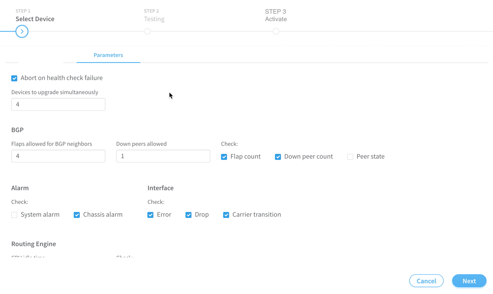
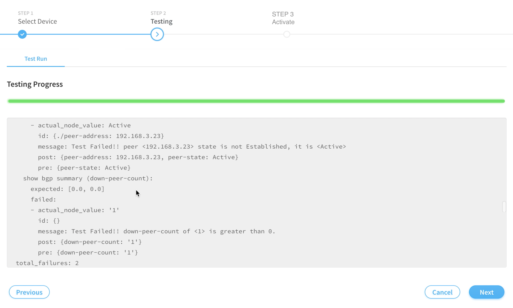
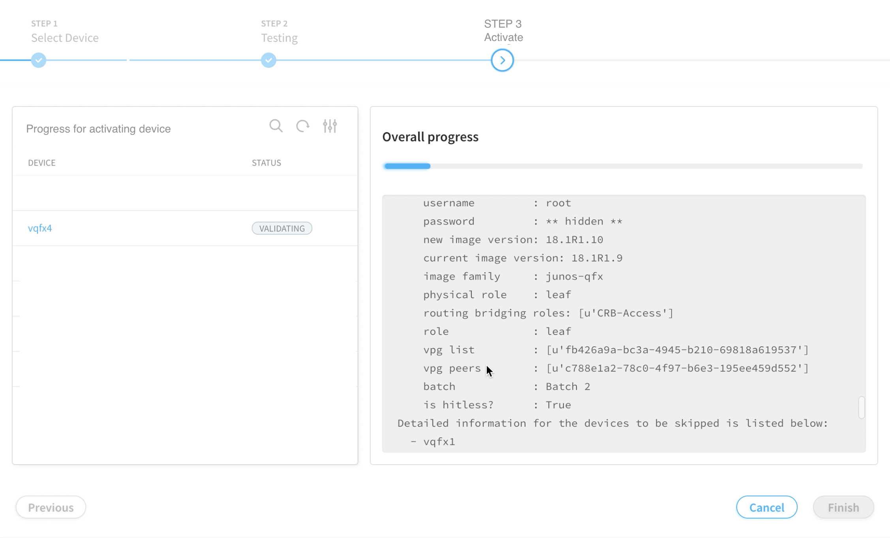
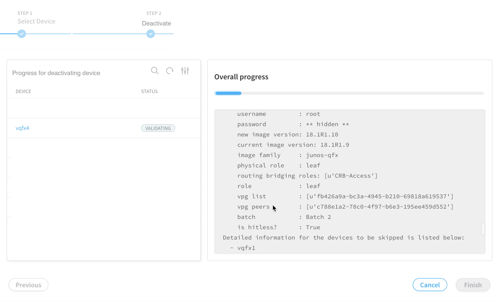

# 1. Introduction
Network devices need occasional maintenance windows to perform image upgrades,
swap line cards, etc. The existing hitless image upgrade workflow provides
a process in which devices are first placed into a maintenance mode, the
device image is upgraded, and then the device is taken out of maintenance mode.
We want to have the additional flexibility to take a device in and out of
maintenance mode without upgrading the image.

# 2. Problem statement
There is currently no way to place a device into maintenance mode without
also upgrading the image.

# 3. Proposed solution
We will provide two new workflows, one to enter maintenance mode and one to
exit maintenance mode. At this time, we are only supporting one device per
workflow. However, it is possible to execute multiple workflows in sequence.

1) Activate-Maintenance-Mode Workflow
- Input: fabric_uuid, device_uuid, mode (test, activate), advanced_parameters.
- Perform health checks on the device. Test-only phase.
- If any health checks fail, edit advanced_parameters as needed, or fix issues in the network,
 until health checks pass.
- Activate maintenance mode. This sends configuration to the device to divert
traffic away.

2) Deactivate-Maintenance-Mode Workflow
- Remove maintenance-mode configuration from device, allowing traffic to once again flow through.
- Run another health check

# 4. User workflow impact
The steps involved in the UI are similar to the hitless image upgrade workflow.
Therefore, it is desirable to emulate that same workflow here as much as possible.
This will give the UI a similar look and feel between operations and allow users
of the hitless image upgrade feature to easily navigate maintenance mode.

Hitless image upgrade uses a wizard to guide the user through the health check phase.
This is important because the user may need to go back and forth between the 
advanced_parameters page and the test run itself. Since activating
maintenance mode also runs these same health checks, it is important to
provide this same capability, at least for activate maintenance mode.
Deactivating maintenance mode may not need a wizard, but it would be useful
to display the job logs in progress.

1) Activate-Maintenance-Mode

Unlike hitless image upgrade, maintenance mode activation does not require the
user to select an image and a list of devices for upgrade.
In this case, we only need to select a device. Here are the sequence of steps.

- Select device and initiate "activate maintenance mode" action
- Screen1: Parameters page. Show advanced_parameters just like with hitless image upgrade
and allow the user to modify these parameters if desired. "Next" button at the bottom
will trigger UI to call activate-maintenance-mode workflow with mode=test_run.

#### - Screen1: Parameters Page

- Screen2: Job progress page. Show job progress of test run just as with hitless image upgrade.
We have a choice here of whether or not to show the device state in one window along
with the job status in another window. While displaying the device state is optional, it is a
nice summary for the user to view. So it is recommended to display device state in addition
to job logs.
"Previous" button allows the user to go back to Screen1 in order to modify parameters.
"Next" button will trigger UI to call activate-maintenance-mode workflow with mode=activate.
A warning dialog should display warning the user, similar to hitless image upgrade.

- Note: The sample image below was created from the existing hitless image upgrade workflow,
which only shows job logs during the test run. So this image is an example of what Screen2
could look like without showing device status.

#### - Screen2: Job Progress Page - Test-Run

- Screen3: Job progress page. Show job progress of activate workflow, same as with
hitless image upgrade. "Finish" button will quit wizard. As with Screen2 above, it is optional
but recommended to display device status along with the job logs. The sample image below is an example which shows
device status.

#### - Screen3: Job Progress Page - Activate

2) Deactivate-Maintenance-Mode

- Select device and initiate "deactivate maintenance mode" action.
- Screen4: Job progress page. Show job progress of deactivate workflow.
This page is similar to Screen3 of the activate workflow.
This will show the results of the last health check. In this case, however,
the user cannot modify advanced_parameters, so there is no need to display
the parameters page. "Finish" button will quit wizard. As with the activate
workflow, it is optional but recommended to display device status along with the job logs.

#### - Screen4: Job Progress Page - Deactivate

# 5. References
